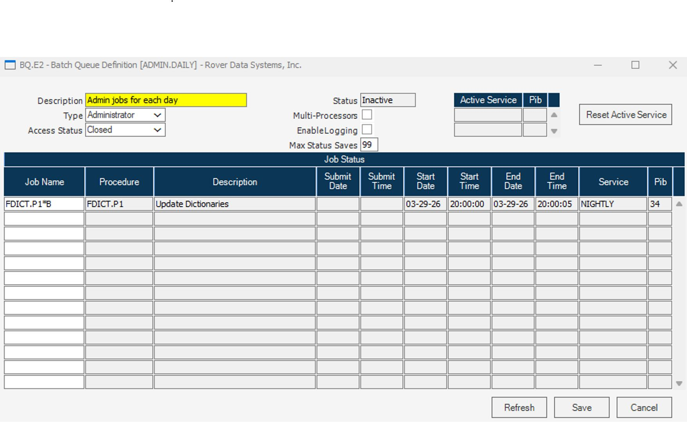
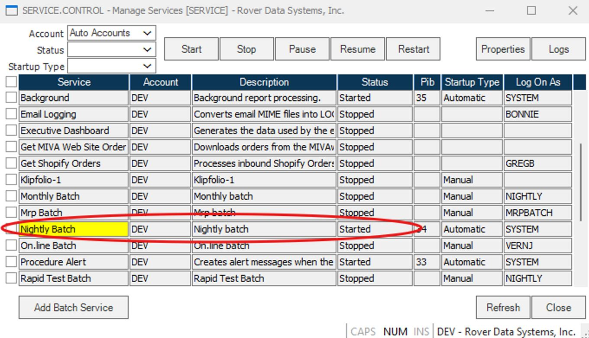
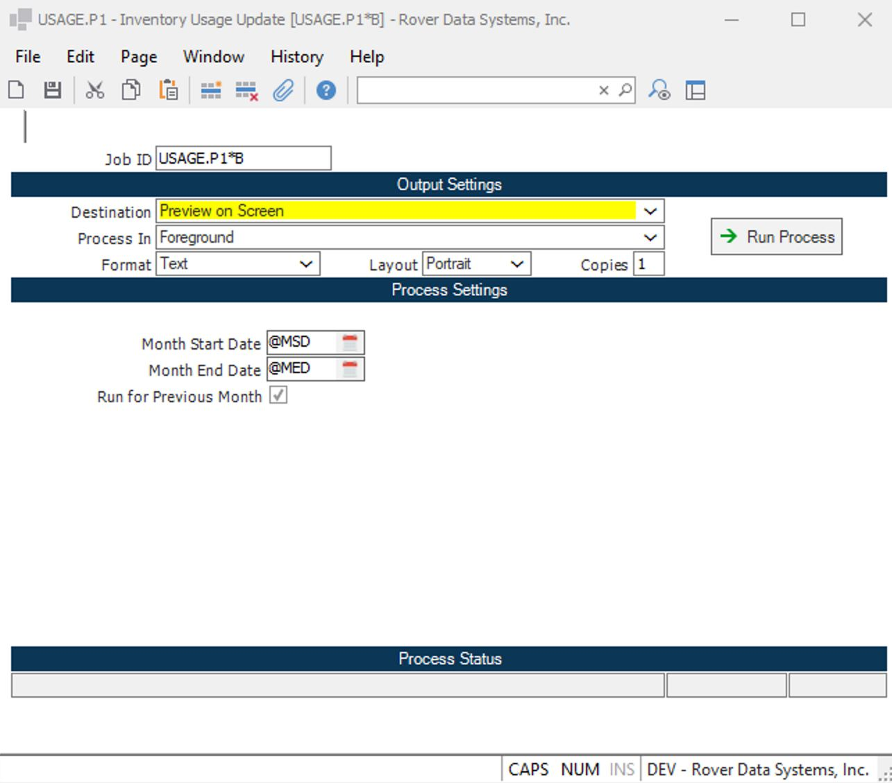

# Resolving USAGE.P1 Not Capturing Data for a Specific Period in RoverERP

<PageHeader />

<badge text='Troubleshooting' vertical='middle' />

## Problem Statement

USAGE.P1 did not report any data for a previous month or specific period, resulting in missing usage data.

---

## Symptoms

- USAGE.P1 reports are blank or missing data for a specific period (e.g., previous month)
- Usage data is incomplete or not updated as expected

---

## Cause

- **USAGE.P1** may not have been scheduled or run as part of the **NIGHTLY** or **MONTHLY** batch process
- The service responsible for running **USAGE.P1** may not have been started or may have failed during the relevant period
- If the service was not running, usage data for the missed period will not be captured automatically

---

## Resolution Steps

1. **Confirm Batch Scheduling**

   - Open **SERVICE.CONTROL** from the command prompt
   - Locate the **Nightly** or **Monthly** batch
   - Highlight the batch and click **Properties > More Settings > Edit Queue**
   - Check if the **USAGE.P1** job is listed in the **Batch Queue Definition**

2. **Check Service Status**

   - Verify that the service responsible for running the batch is in a **Started** status
   - If the service is not running, start it

3. **Manually Run USAGE.P1 for Missed Periods**

   - If the service was not running or the job was missed, **USAGE.P1** must be run manually for the affected period(s)
   - At the command prompt, type **USAGE.P1**
   - Provide the appropriate **Job ID** and set the dates for the period that needs to be processed
   - If multiple periods are missing, process each period one at a time

---

## Verification

- [ ] Confirm that **USAGE.P1** now reports data for the previously missing period(s)
- [ ] Ensure that usage data is complete and accurate for all required dates

---

## Note

- Always verify that batch jobs and services are scheduled and running as intended to prevent missed data in the future
- Document any manual runs of **USAGE.P1** for audit and tracking purposes

---

## Additional Information

- For persistent issues or if you require assistance with batch scheduling, contact RoverERP support
- Regularly monitor batch job status and service logs to ensure all critical processes are running

<PageFooter />
