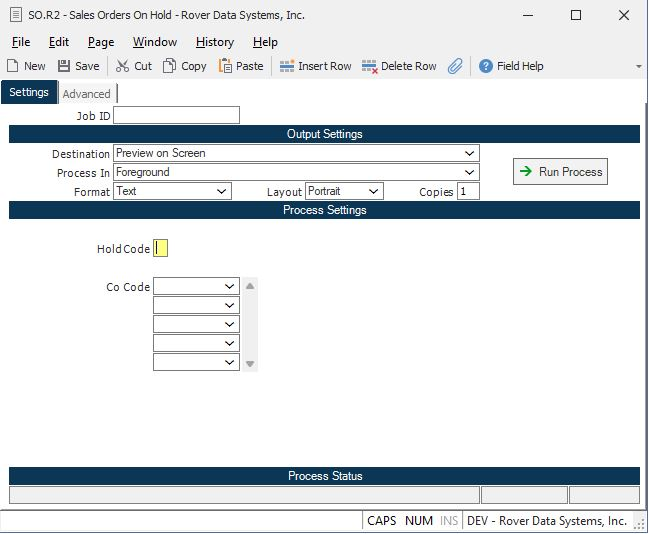

# How to Search for Sales Orders with the Hold Type "DRAFT" in RoverERP

<PageHeader />

## Problem Statement

Users need to identify and review sales orders that are currently in a **DRAFT** hold status. Orders or line items on hold cannot be shipped, and it is necessary to generate a report listing these orders for further action.

---

## Symptoms

- Sales orders in **DRAFT** hold status are not progressing to shipment
- Users require a method to search for and list all sales orders with the hold type **DRAFT**
- There is uncertainty about how to generate a report of orders on hold

---

## Cause

- In the standard RoverERP product, any order or line item placed on hold (including **DRAFT** status) cannot be shipped
- Users may not be aware of the correct procedure or report to use for identifying orders with a specific hold type

---

## Resolution Steps

### 1. Use the SO.R2 Report to List Orders on Hold

1. Navigate to: **Sales Orders > Reports > SO.R2** (Orders on Hold)
2. When prompted, enter `DRAFT` in the hold code field to filter for orders with the **DRAFT** hold type
3. If you leave the hold code field blank, the report will list all orders currently on hold, regardless of hold type

### 2. Review the Report Output

- The report will display all sales orders (or line items) that are on hold with the specified hold code
- Use this information to identify which orders are in **DRAFT** status and require further action

### 3. Take Appropriate Action

- Review the listed orders to determine if they can be released from hold or require additional processing
- Orders must be removed from hold status before they can be shipped

---

## Verification

- [ ] Confirm that the **SO.R2** report lists all sales orders with the `DRAFT` hold type
- [ ] Ensure that no orders intended for shipment remain in **DRAFT** hold status unless required

---

> **Note:**  
> The **SO.R2** report is the standard method for listing orders on hold in RoverERP. If your organization has custom modifications, the process may differ. Consult your system administrator if you do not see expected results.

---

## Additional Information

- Orders or line items on hold cannot be shipped until the hold is released
- For further assistance or if you encounter issues with the report, contact RoverERP support

---

<PageFooter />
