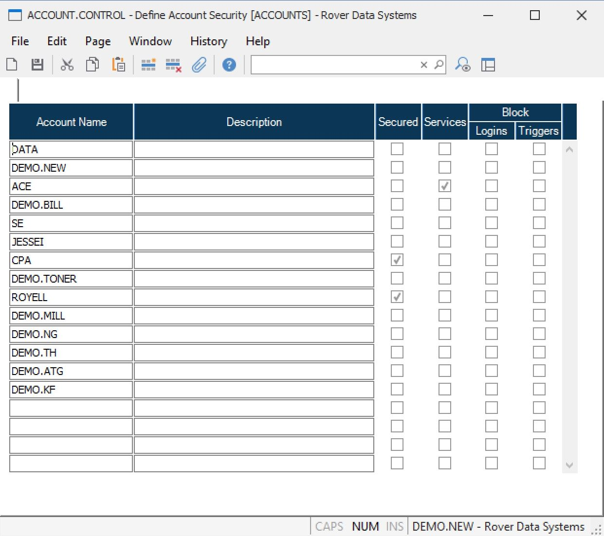

# Securing Accounts with ACCOUNT.CONTROL in RoverERP

<PageHeader />

<badge text='Administration' vertical='middle' />

## Purpose of how ACCOUNT.CONTROL is used to secure the accounts.

- If the account should be secured, the “secured” box must be checked. If the account is not listed in the record or the ‘secured’ box is not checked, the account is considered unsecured.

- If the account is secured, users with a security level of “user” in SECURITY.E will only be able to access the commands entered on their profile for the account. If the account is unsecured, users will be able to access most commands.

---

## Resolution Steps

1. **Access ACCOUNT.CONTROL**

   Navigate to: **Security > ACCOUNT.CONTROL**.

2. **Secure an Account**

   Enter the account name in the list and set the value to **Y** to indicate the account should be secured.

3. **Unsecured Accounts**

   Accounts not listed, or listed without a **Y**, will:

   - Allow login with any user ID and will not prompt for a password
   - Leave users at the system-level command prompt if they exit the menu (e.g., by pressing **F1**)

4. **Secured Accounts**

   Accounts marked with a **Y** will:

   - Prompt users for a password after entering their user ID
   - Validate the password against the user profile
   - Log users off when they exit the menu (e.g., by pressing **F1**)

---

<PageFooter />
