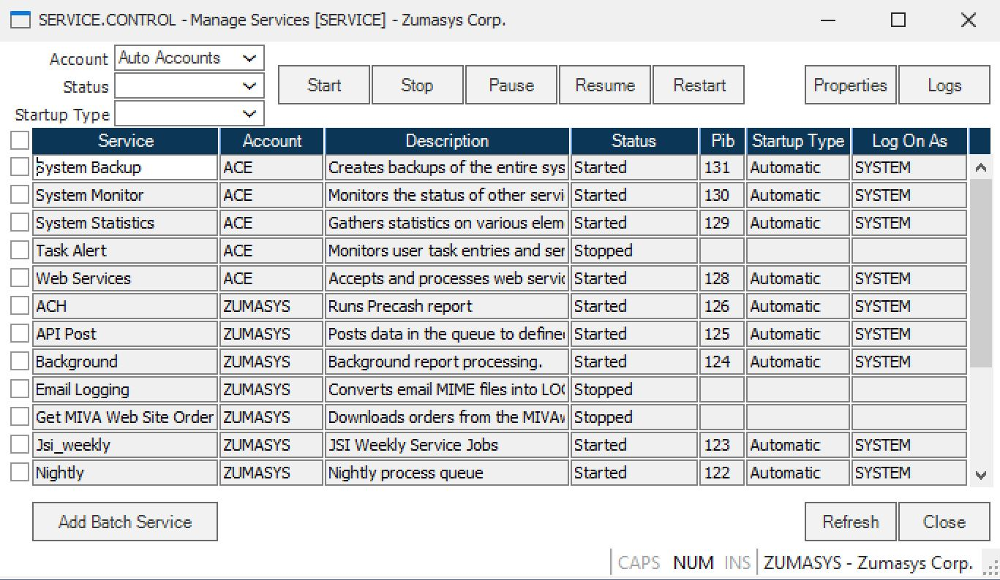
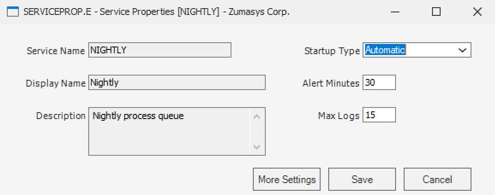
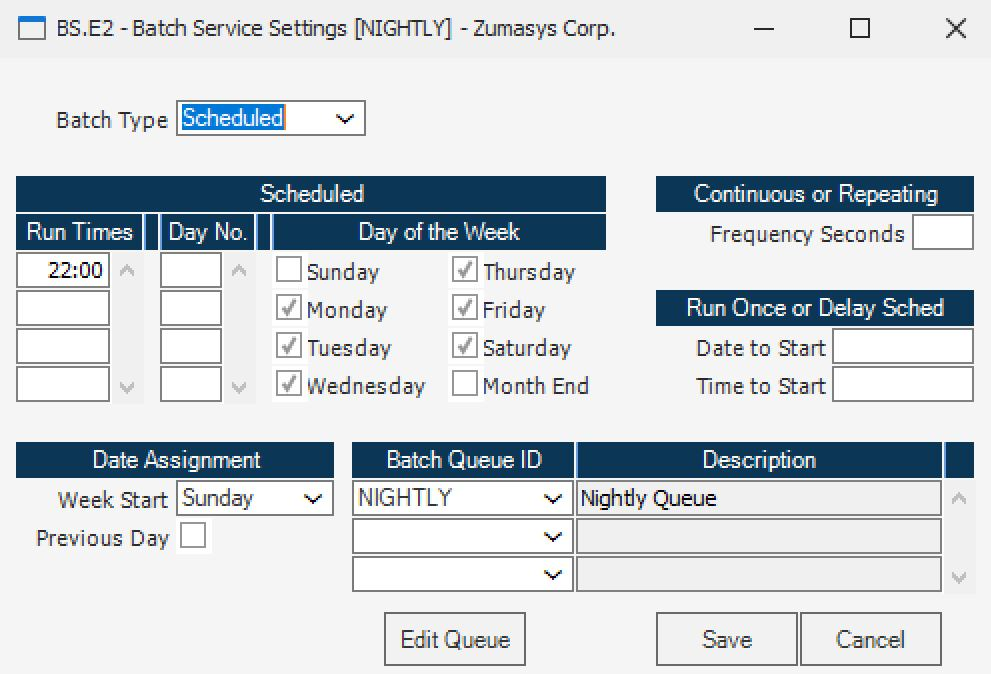
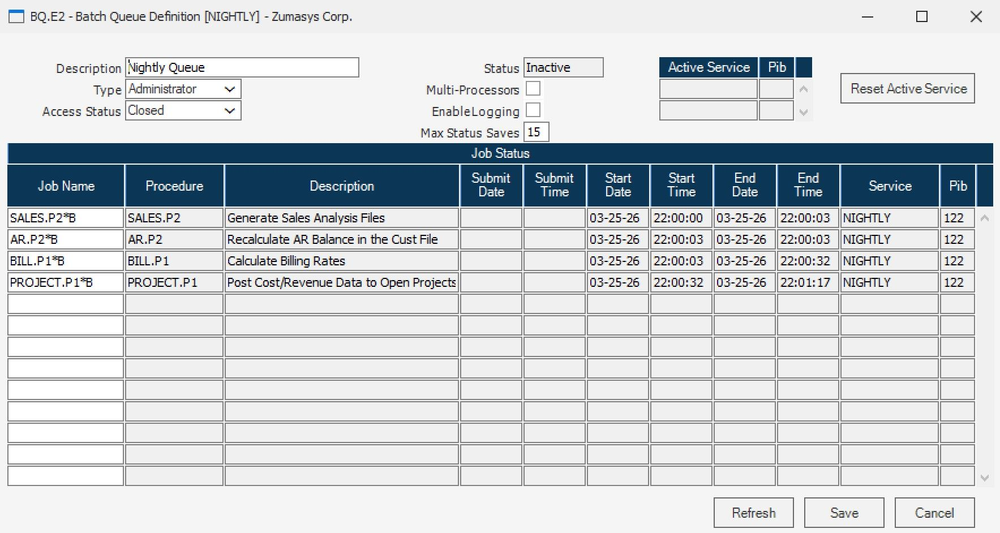
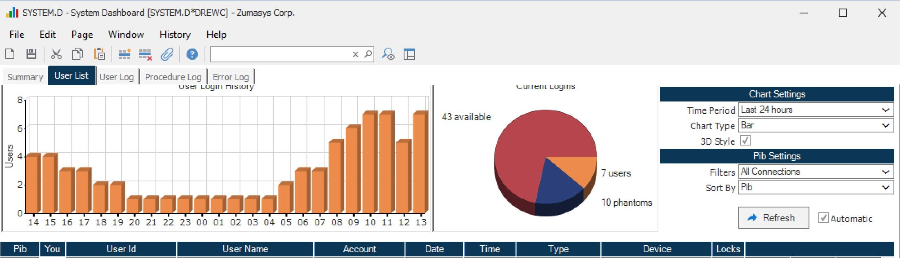

# Service/Batch Will Stall or Show a Status of "Non Responding"

<PageHeader />

<badge text='Service' vertical='middle' />

## Overview

One of the more common reasons a service or batch will stall or show a status of **"non responding"** is because of **record locks**. This article walks through how to diagnose and resolve the issue.

---

## Resolution Procedure

### Step 1: Open Batch Properties in SERVICE.CONTROL

Open **SERVICE.CONTROL**, highlight the affected batch, and press the **Properties** button.

---

### Step 2: Access More Settings in SERVICEPROP.E

**SERVICEPROP.E** will open. Press the **More Settings** button.

---

### Step 3: Open the Edit Queue in BS.E2

**BS.E2** will open. Press the **Edit Queue** button.

---

### Step 4: Review Jobs in BQ.E2

**BQ.E2** will open. This screen lists the jobs that have been added to the batch and displays the dates and times each job last ran.

The name of the command executed by the job is shown in the **Procedure** column. Some commands place a lock on the records being created or updated. If a job did not complete — for example, `PARTS.P4` — it may be the result of a record lock.

---

### Step 5: Identify Record Locks in SYSTEM.D

Open **SYSTEM.D** (ACE module > Reports & Inquiries menu) and navigate to the **User List** tab.

This tab displays all users currently logged into the system along with the number of locks held by each user. In the **Locks** column, there are lookups to display the specific records locked by an individual user or all users.

---

### Step 6: Resolve the Lock

If, for example, there is a lock on a parts record, it is likely the reason **PARTS.P4** did not complete. Ask the user who is holding the lock to exit out of that record.

Once the lock is released, the service should continue processing normally.

---

## Troubleshooting Checklist

- [ ] Open **SERVICE.CONTROL** and check the batch properties
- [ ] Navigate through **SERVICEPROP.E** > **BS.E2** > **BQ.E2** to identify the stalled job
- [ ] Note the command in the **Procedure** column for the job that did not complete
- [ ] Open **SYSTEM.D** (ACE module > Reports & Inquiries menu) > **User List** tab
- [ ] Identify which user is holding a lock on the relevant record
- [ ] Ask the user to exit the locked record
- [ ] Confirm the service resumes processing

---

## Related Articles

- [Resolving Locked Records In Rover](../Resolving-Locked-Records-In-Rover/index.md)

<PageFooter />
