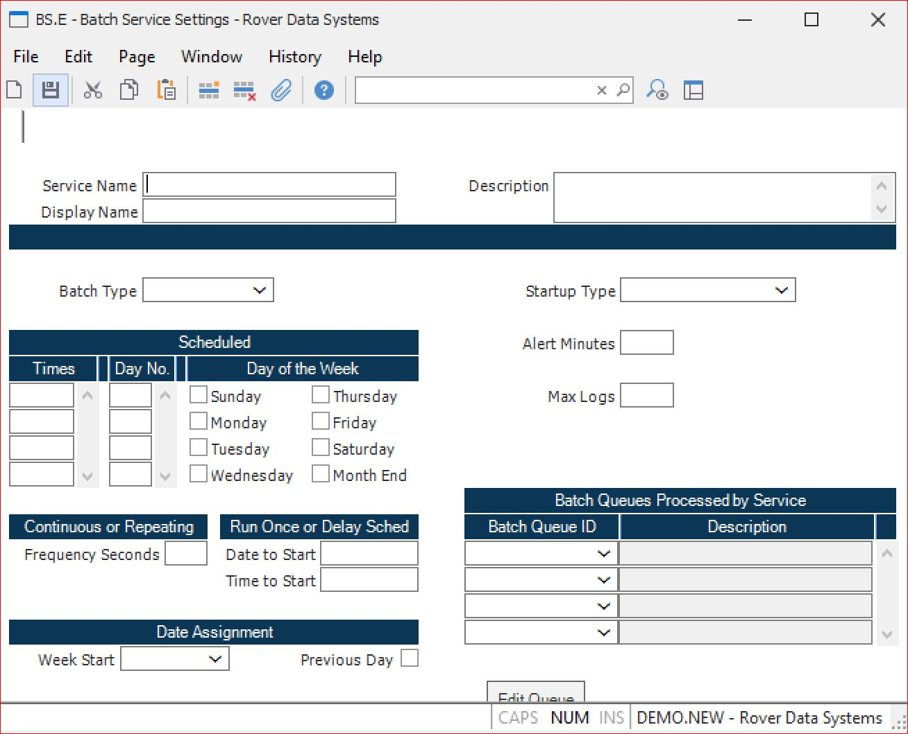

# Setting Up Batch Services in RoverERP

<PageHeader />

<badge text='Administration' vertical='middle' />

## Problem Statement

Administrators need to configure batch services in RoverERP to automate scheduled processes, manage job queues, and set up service parameters for optimal system operation.

---

## Symptoms

- Need to create or modify batch services for automated job processing
- Requirement to schedule services to run at specific times or intervals
- Necessity to configure date parameters and user credentials for batch jobs

---

## Cause

- RoverERP batch services require proper configuration to execute scheduled processes efficiently
- Different batch types serve different operational needs

---

## Service Configuration

Enter the necessary information to set up (or make necessary changes in amendment mode) for a batch service. The information entered on this main display will be used for the other procedures in the SERVICE.CONTROL job flow (i.e., service editing screens).

### Service Name

Enter a short descriptive name for the service.

### Display Name/Description

Enter a name and description for the service.

### Batch Type

The **Batch Type** must be set to **Scheduled**, **Continuous**, **Repeating**, or **Run Once**. The following are details for each batch type:

#### Scheduled

The **Times** field must be set to one or more times at which the process is to be started. Times are specified in 24-hour format. You must also specify a **Day#** of the month and/or check one or more days or **Month End**.

#### Continuous

The **Frequency Seconds** must be set. Frequency seconds indicates how often it should check for new jobs that have been submitted. Continuous batch processes wait for users to submit jobs to be run.

#### Repeating

A service which will repeat as defined by the user. **Frequency Seconds** indicates how often the job(s) should be run.

#### Run Once

The specified service will run once and only once as defined.

### Date Parameter Usage

Some jobs in a batch may have date parameters that need to change each time the batch is run. Dates may be specified with a pseudonym in place of the date indicating which date should be used when the job is run:

- **@SD** – the current date
- **@WSD** – week start date
- **@WED** – week end date
- **@MSD** – month start date
- **@MED** – month end date
- **@YSD** – year start date
- **@YED** – year end date

**Note:** In order to properly assign these dates, the **Week Start** must be specified as one of the days of the week, typically either **Sunday** or **Monday**. The **Previous Day** checkbox indicates if the dates should be determined based on the date before the current date. For example, if the batch service is set to start at 1:00 A.M. but the jobs in the batch need to be run for the previous date, check this box.

### Startup Type

Select the startup condition for the service when M3 is started. Valid selections are **Automatic**, **Manual**, and **Disabled**. If the service is ongoing, select the **Automatic** condition.

### Logon As/Password

Enter the user and password for the job. The user assigned will require the rights necessary (if any exist) for executing the job. If the user profile does not exist, the system will create a new profile.

### Batch Queue ID

This field defines which job queues the service is to process. You may select existing queues from the drop-down list or select **&lt;create new queue&gt;** to define a new queue. An existing queue can be edited by clicking the **Edit Queue** button.

---

## Verification

- [ ] Confirm that all required service parameters are configured correctly
- [ ] Verify that the batch type is appropriate for the intended operation
- [ ] Ensure that date parameters are set up correctly for scheduled jobs
- [ ] Confirm that the user credentials have the necessary permissions to execute the service
- [ ] Test the batch service to ensure it executes as expected

---

## Note

- Configure **Startup Type** as **Automatic** for services that should run continuously or on a regular schedule
- Always verify user credentials and permissions before deploying batch services
- Use date pseudonyms to ensure batch jobs run with the correct date parameters

---

## Additional Information

- For issues with batch service configuration, contact your system administrator or RoverERP support
- Review RoverERP documentation for detailed information on specific batch job requirements

<PageFooter />
