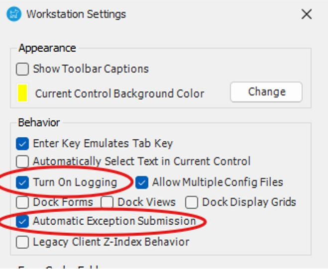

# Troubleshooting Application Crashing in RoverERP

<PageHeader />

<badge text='Troubleshooting' vertical='middle' />

---

## Resolution Steps

1. **Check for Latest Version**

   From the main window, click **Help > About** to verify your current version. Ensure you are running the latest version. Release notes and downloads are available in **RoverERP Release Notes**.

2. **Enable Logging and Exception Submission**

   Go to **File > Settings**. Enable logging and exception submission to allow logs to be uploaded for support review.

3. **Capture Information for Ticket Submission**

   Try to replicate the issue and note the following:

   - Does it occur on multiple computers or for multiple users?
   - Which module are you in when the crash occurs?
   - Does it happen for a single record or multiple records (e.g., SO #, PO #, Part #)?

   Record these details:

   - Program version in use
   - Account name
   - Affected user(s)
   - Any error windows or messages displayed

4. **Submit a Support Ticket**

   Once you have gathered the above information, email [help@zumasys.com](mailto:help@zumasys.com) to create a support ticket.

---

<PageFooter />
