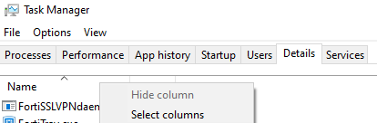
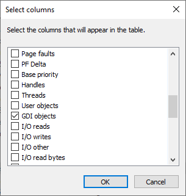
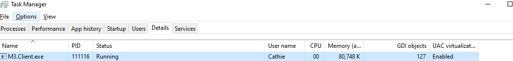

# Troubleshooting Rover Disconnects 

## Rover ERP – Client Update Installation, Logging & GDI Monitoring Guide

## Overview

This update ensures improved stability and diagnostic capabilities. Users should confirm their installed version, upgrade to the version shared by their support engineer, enable logging, and follow crash reporting and monitoring procedures.

> **Summary:** Confirm installed client version → install update provided by engineer → enable logging → collect crash logs → monitor GDI object counts.

---

## Prerequisites

- Windows user with local admin rights
- Stable internet connection
- Space to download and unzip the installer package
- Target PCs selected for update

> **Summary:** Confirm admin access and internet; prepare PCs for update.

---

## Check Your Current Client Version

Before updating, verify which version of the Rover ERP client you are running.

1. Launch **Rover ERP Client**
2. Go to **Help → About**
3. In the About dialog, note the version number displayed
4. If it is lower than the version provided by your support engineer, proceed with the update. If already at that version, no further update is required.

**tip:** Capture a screenshot of the version info if you need to confirm with IT.

> **Summary:** Use Help → About to confirm if you need the update.

---

## Install the Update

Your support engineer will provide:
- The version number you should update to
- The download link to the installer package

1. Download the installer package from the link provided
2. Right-click the ZIP → **Extract All…** to a local folder (e.g., `C:\Temp\RoverUpdate`)
3. In the extracted folder, right-click the installer (`.exe` or setup) → **Run as administrator**
4. Follow on-screen prompts to complete the installation
5. Launch Rover ERP to confirm it opens without errors
6. Repeat the [Check Your Current Client Version](#check-your-current-client-version) step to confirm you are now running the new version

> **Summary:** Use the link from the engineer, extract, run installer as admin, then verify version matches what they provided.

---

## Enable Diagnostic Logging

1. Open **Rover ERP**
2. Go to **File → Settings**
3. Check **Enable logging**
4. Click **Save** (or OK) to apply
5. Restart Rover ERP to ensure logging is active

> **Summary:** Enable logging under File → Settings and restart the app.

---

## Managing Performance Impact of Logging

While logging is useful for diagnosing crashes, it may slow down performance in some cases.

If you notice sluggish performance or lag after enabling logging:

1. Go back to **File → Settings**
2. Uncheck **Enable logging**
3. Save your changes and restart Rover ERP

 **warning:** If a crash occurs while logging is disabled, you will not have logs to send to support. Consider re-enabling logging temporarily if directed by your engineer.

> **Summary:** Disable logging if it significantly slows down performance, but re-enable when asked to collect logs.

---

## Collect & Send Crash Logs

When Rover ERP crashes, a dialog will appear with the log file path.

1. Copy the file path from the crash dialog (use the copy button or **Ctrl+C**)
2. Paste the path into **File Explorer** and press **Enter**
3. Locate the log file (and any related `.dmp` files)
4. Send these files to your support contact, including:
   - What you were doing when it crashed
   - Number of open Rover windows
   - Current GDI objects count (if monitored)

> **Summary:** Copy the crash path → open in Explorer → send log/dump with context.

---

## Monitor GDI Objects in Task Manager

1. Open **Task Manager** (`Ctrl+Shift+Esc`)
2. Go to the **Details** tab
3. Right-click column header → **Select columns**
4. Enable **GDI objects** → click **OK**
5. Keep Task Manager open while working

::: danger
If the Rover process approaches **10,000 GDI objects**, save your work and restart Rover ERP immediately.
:::

> **Summary:** Add GDI objects column; restart Rover before 10K.

## Troubleshooting & Workarounds

| Issue | Solution |
|-------|----------|
| **Installer blocked** | Run as admin; allow-list on test PCs if security tools block it |
| **No crash dialog** | Confirm logging is enabled; check `%LOCALAPPDATA%\Rover\Logs` manually |
| **Cannot open crash path** | Ensure path was copied correctly; paste directly into File Explorer |
| **High idle GDI** | Close unused Rover windows; restart periodically |

> **Summary:** Confirm logging, retrieve logs manually if needed, restart Rover to manage GDI counts.

---

## Best Practices

- Always confirm your version before and after updating
- Enable logging on all updated PCs (disable only if performance is degraded)
- Monitor GDI counts during heavy usage
- Restart Rover proactively at **8,000–10,000** GDI objects
- Provide detailed context with crash logs

> **Summary:** Confirm version, manage logging settings, monitor GDI counts, restart proactively, and submit detailed crash reports.

---

## Glossary

| Term | Definition |
|------|------------|
| **Rover ERP Client** | The Windows desktop application |
| **Update** | Installation package intended to replace/upgrade the existing client |
| **GDI Objects** | Windows graphical resources; excessive counts (~10,000) can cause app closure |
| **Crash Dialog** | Pop-up after a crash showing the log file location |

> **Summary:** Key terms include Rover ERP client, update, GDI objects, and crash dialog.

---

## Quick Reference

| Task | Steps |
|------|-------|
| **Check version** | Help → About |
| **Download update** | Link provided by your support engineer |
| **Enable logging** | File → Settings → Enable logging → Save |
| **Disable logging** (if slow) | File → Settings → uncheck Enable logging → Save |
| **On crash** | Copy path from dialog → open in Explorer → send log/dump |
| **Monitor GDI** | Task Manager → Details → Select columns → GDI objects; restart Rover before 10K |
<PageFooter />
