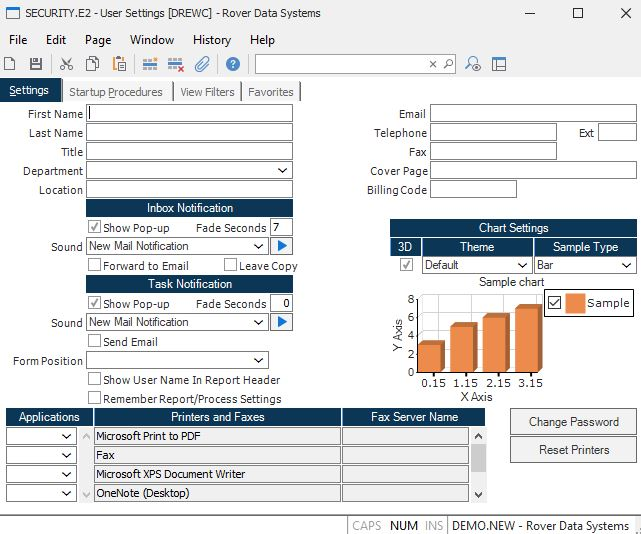

# Unable to Create the Excel File (Legacy Client)

<PageHeader />

Use this guide when users are unable to create an Excel file in the Legacy Client.

## 1. Determine Scope

Check whether the issue occurs for a single user or all users.

## 2. Verify Excel Application

Confirm that `Excel` is listed as an application in `SECURITY.E2`.

## 3. Enable Use XLS

In `SECURITY.E2`, make sure **Use XLS** is selected.

<PageFooter />
