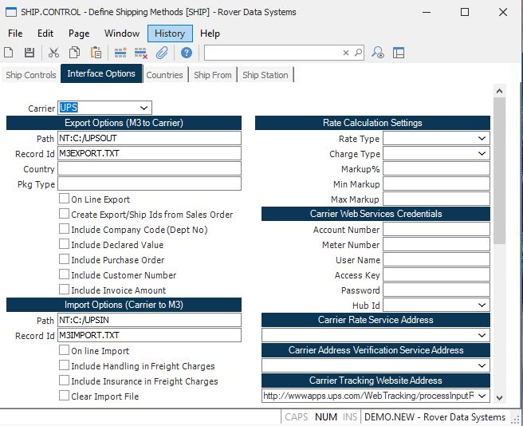

# Unable to save a shipper in SHIP.E or SHIP.E2

<PageHeader />

## Things to check

### 1. Verify shipping carrier interface configuration

If the shipper is scheduled to ship via **UPS** or **FedEx**, follow these steps:

1. Open **SHIP.CONTROL** (navigate to **Sales/Marketing module** > **Data Entry menu**)
2. Go to the **Interface Options** tab
3. Check if the company is interfacing or exchanging data with **UPS** or **FedEx**

If you are exchanging data with either carrier, proceed to the next step.

### 2. Check operating system folder permissions

Contact your **system administrator** to verify that users have the necessary rights at the operating system level (**Windows** or **Linux**) to access the carrier interface folders.

<PageFooter />
