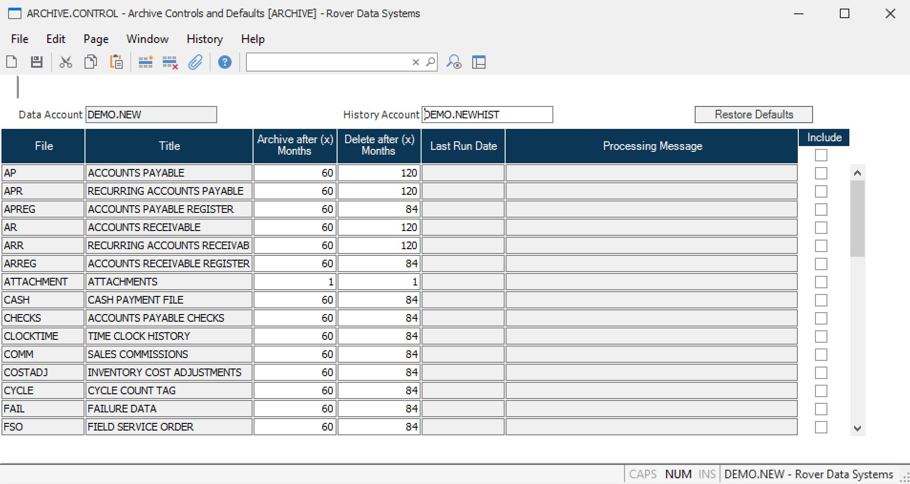

# Using PURGE.CONTROL to Archive or Purge Data in RoverERP (For Versions Prior to 11-14-23)

<PageHeader />

<badge text='Administration' vertical='middle' />

---

## Resolution Steps

**Note:** The **PURGE.CONTROL** command only applies to customers on a version prior to **11-14-23**. In later versions, use **ARCHIVE.CONTROL**.

1. **Access PURGE.CONTROL**

   Open the **PURGE.CONTROL** procedure in RoverERP. (Replaced with Archive.Contrtol)

2. **Specify the History Account**

   In the first field, enter the name of the history account where archived data should be stored.

   - If a history account is entered, data will be written to this account before being deleted from the source account
   - Each data account should have its own corresponding history account
   - If no history account is entered, data will be purged (deleted) without being archived

3. **Select Files to Archive or Purge**

   Use the lookup from the file name field to select files eligible for archiving or purging.

4. **Set Cutoff Date and Include Files**

   Enter a cutoff date for data to be archived or purged. Check the **include** boxes for the files you want to process.

5. **Run the Purge Process**

   You can run the purge process (for example, **PARTS.P2**) directly from the **PURGE.CONTROL** screen or independently.

   - If run from **PURGE.CONTROL** and a history account is specified, data will be archived before deletion
   - If run outside of **PURGE.CONTROL**, data will be deleted without archiving, even if a history account is specified in the control record

6. **Repeat for Different Files and Retention Periods**

   To keep different amounts of history for different files, run **PURGE.CONTROL** multiple times with different settings, such as **2 years** for IT and register files and **5 years** for sales files.

---

<PageFooter />
