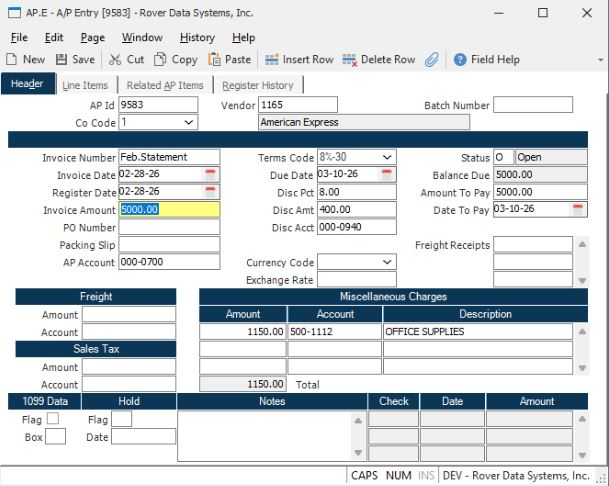
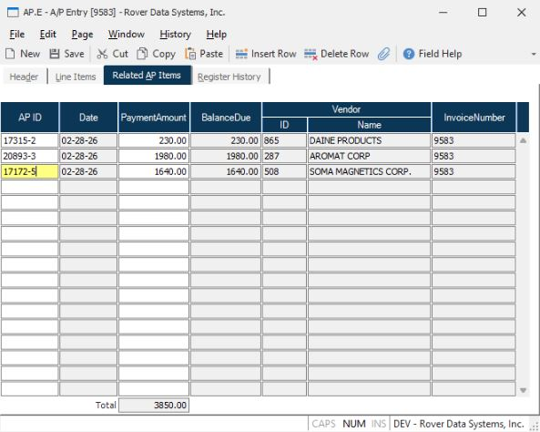
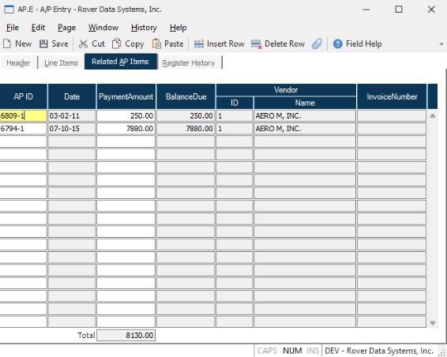
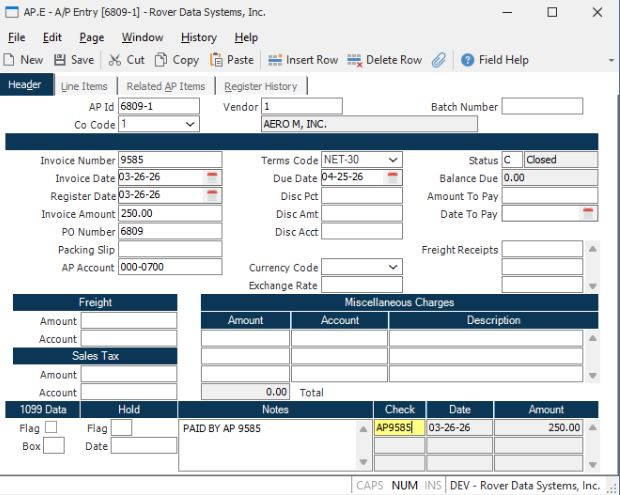

# Using the Related AP Items Function in AP.E for Credit Card Payments and Invoice Consolidation

<PageHeader />

---

## Resolution Steps

### Example 1: Handling Credit Card Payments

**1. Create a New Invoice for the Credit Card Provider**

In **AP.E**, create a new invoice for the credit card provider.

- Leave the **AP ID** field blank; an AP ID will be assigned automatically when the record is saved.

**2. Enter Related Vendor Invoices**

Navigate to the **Related AP Items** tab.

- Enter the AP IDs of the vendor invoices that were paid on the credit card statement.
- The AP IDs can be in either **"invoiced"** or **"accrual"** status.

**3. Adjust Payment Amounts if Needed**

- You may change the payment amount for each related item, but the amount cannot exceed the open balance.
- If there is a difference between the total related amount and the statement amount, apply the difference to a GL account (e.g., office supplies as a miscellaneous charge).

---

### Example 2: Creating a Single Invoice for Multiple Receipts

**1. Create a New Consolidated Invoice**

In **AP.E**, leave the **AP ID** field blank.

- Enter the vendor number, invoice number, date, and amount for the new consolidated invoice.

**2. Add Related Receipts or Invoices**

On the **Related AP Items** tab, enter the AP IDs or receipts you wish to consolidate into this single invoice.

**3. Save the Record**

When the record is saved:

- The IDs entered on the **Related AP Items** tab will be flagged as paid.
- The **check number** for these items will be the AP ID of the newly created consolidated invoice.

**4. Verify Status**

- If the invoice is paid in full, its status will be changed to **"closed."**

---

<PageFooter />
