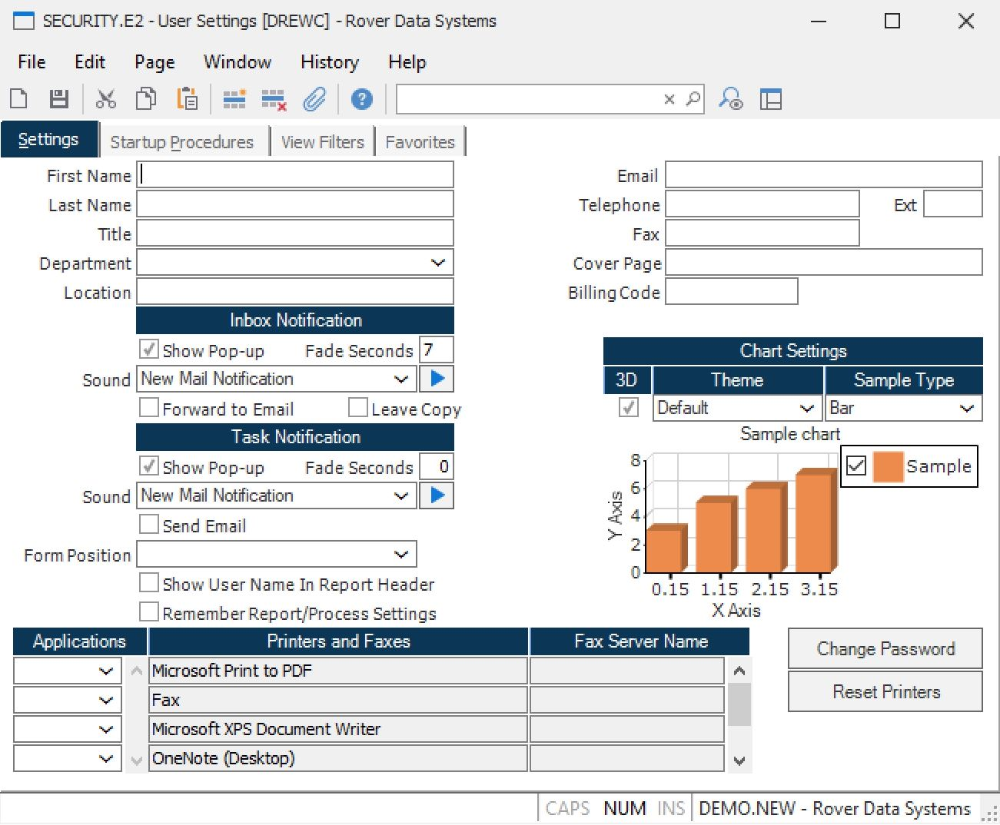

# Using SECURITY.E2 for Password Reset and Printer Reset in RoverERP

<PageHeader />

<badge text='Administration' vertical='middle' />

## Problem Statement

Users may need to reset their own passwords or resolve issues where newly added printers in Windows do not appear in RoverERP.

---

## Symptoms

- Users are unable to change their own passwords and may receive an authorization error
- Printers added in Windows are not showing as available in RoverERP

---

## Cause

- Password reset permissions may be restricted by system security settings
- The list of available printers in RoverERP may not update automatically after adding a new printer in Windows

---

## Resolution Steps

### Resetting User Passwords

1. **Access the Change Password Option**

   Open **SECURITY.E2** in RoverERP and select the **Change Password** option.

2. **Follow the Prompts**

   Enter the required information to reset your password.

3. **Authorization Error**

   If you receive a message stating you do not have authorization to change the password, contact your system administrator for assistance.

### Resetting Printers

1. **Add Printer in Windows**

   Ensure the printer has been successfully added in Windows.

2. **Reset Printers in RoverERP**

   Open **SECURITY.E2** in RoverERP and select the **Reset Printers** option.

3. **Verify Printer Availability**

   Check that the newly added printer now appears as available in RoverERP.

---

## Verification

- [ ] Confirm that users can reset their passwords if authorized
- [ ] Ensure that newly added printers in Windows are visible and selectable in RoverERP after performing a printer reset

---

## Note

- Only users with the appropriate permissions can change their own passwords
- Contact your system administrator if you encounter authorization issues or if printers still do not appear after resetting

---

## Additional Information

- For persistent issues with password resets or printer availability, contact RoverERP support
- Regularly review user permissions and printer configurations to maintain system accessibility

<PageFooter />
