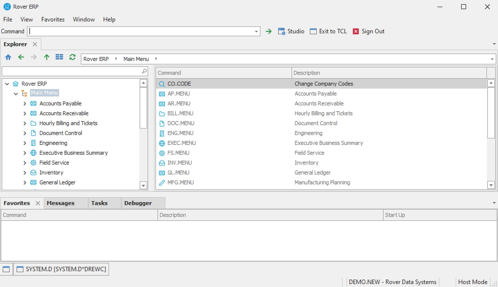

# Using SYSTEM.D: The System Dashboard in RoverERP

<PageHeader />

<badge text='Administration' vertical='middle' />

## Problem Statement

Administrators need a centralized overview of the current and historical state of the RoverERP system, including user activity, resource usage, and system logs.

---

## Symptoms

- Need to monitor system health, user activity, and resource utilization
- Requirement to access logs for troubleshooting or audit purposes
- Desire to manage user sessions directly from a dashboard

---

## Cause

- Ongoing system administration and monitoring require access to real-time and historical system data

---

## Resolution Steps

1. **Access SYSTEM.D**

   Navigate to: **System > SYSTEM.D** (System Dashboard).

2. **Review System Overview**

   The dashboard provides the following information:

   - Users currently logged in
   - Workspace usage
   - Memory usage
   - Storage usage
   - User logs
   - Procedure logs
   - Runtime error logs
   - System error logs

3. **Manage User Sessions**

   Go to the **User List** page within **SYSTEM.D**. View all users currently logged in. Options available for each user:

   - **Logoff**
   - **Reset**
   - **Remove**
   - **Tandem** onto the pib (process in background) of each user

4. **Frequency of Use**

   Use the System Dashboard as required for monitoring, troubleshooting, or routine administration.

---

## Prerequisites

- The historical information displayed is generated by the **System Statistics Service (SYSTEMSTATS)**
- Ensure **SYSTEMSTATS** is set up and running continuously to avoid gaps in historical data

---

## Verification

- [ ] Confirm that real-time and historical system data is displayed accurately
- [ ] Ensure that user session management functions (logoff, reset, remove, tandem) work as expected

---

## Note

- Continuous operation of **SYSTEMSTATS** is essential for complete historical records
- Use **SYSTEM.D** regularly to maintain system health and respond promptly to issues

---

## Additional Information

- For setup or troubleshooting of **SYSTEMSTATS**, consult your system administrator or RoverERP support
- Document any administrative actions taken for audit and compliance purposes

<PageFooter />
