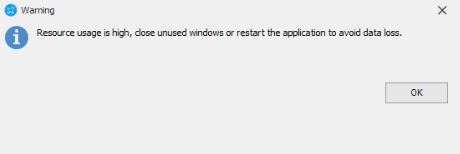

# Resolving High Resource Usage Warning in RoverERP

<PageHeader />

<badge text='Administration' vertical='middle' />

## Problem Statement

Users receive a warning message in RoverERP stating:

> "Resource usage is high, close unused windows or restart the application to avoid data loss."

---

## Symptoms

- Warning message appears about high resource usage
- The warning typically occurs when multiple RoverERP instances, windows, or modules (especially those with many tabs) are open simultaneously
- Users are advised to close unused windows or restart the application to prevent data loss

---

## Cause

- The warning is triggered when the Windows GDI (Graphics Display Interface) resource usage reaches or exceeds a threshold (≥9,000)
- High GDI usage can occur if many RoverERP windows or modules are open at the same time
- This is a known issue and is being addressed in future updates

---

## Resolution Steps

### 1. Close Unused Windows and Modules

- Review all open RoverERP windows, modules, and tabs
- Close any that are not currently needed

### 2. Restart RoverERP

- If the warning persists after closing unused windows, save your work and restart the RoverERP application

### 3. Limit Simultaneous Sessions

- Avoid running multiple instances of RoverERP or opening excessive windows/tabs at the same time

---

## Verification

- [ ] After closing unused windows or restarting the application, the warning should no longer appear
- [ ] Application performance should improve, and the risk of data loss due to a crash is reduced

<PageFooter />
