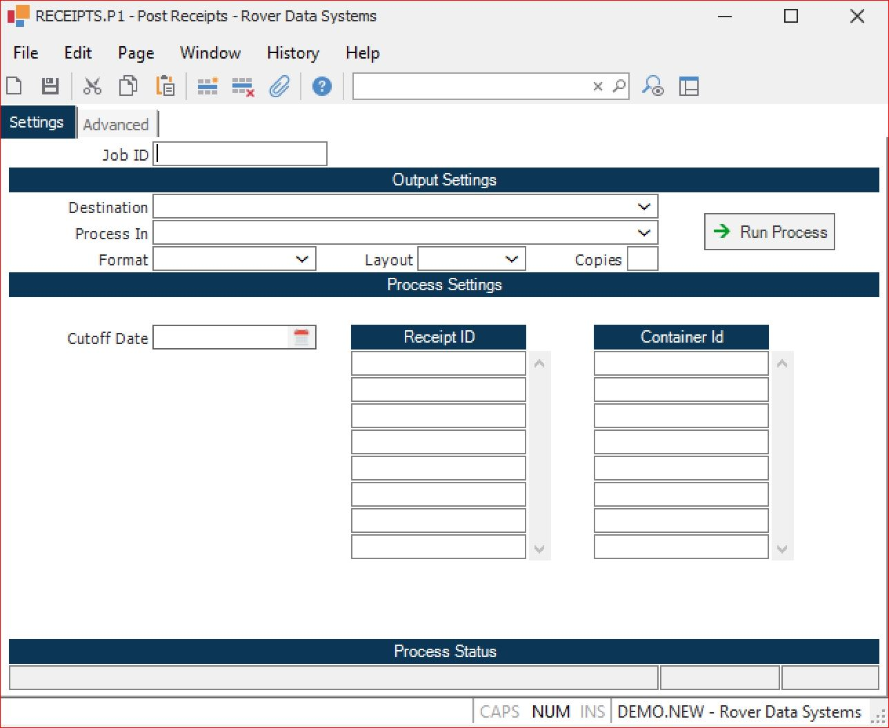

# Working with Batch Queues (BQ.E2) in RoverERP

<PageHeader />

<badge text='Administration' vertical='middle' />

---

## Resolution Steps

### Defining or Amending a Batch Queue

**Description:**

Enter a description for the batch queue being defined or amended.

**Type:**

- Select **Public** to allow general users to submit jobs to the queue
- Select **Administrator** to restrict job submission to administrator users only

**Access Status:**

- Set to **Open** to allow users to submit jobs
- Set to **Closed** to prevent job submission

**Multi-Processor:**

Enable if you want more than one batch service to run jobs in the queue simultaneously. Leave disabled if jobs must run sequentially.

**Max Status Saves:**

Specify how many entries of job history should be retained for the queue.

**Resetting the Batch Queue:**

If a job does not complete correctly and the queue needs to be reset, check the **Active Service** section. If a value is present, press the **Reset** button to reset the queue.

**Viewing Jobs:**

The main display shows all jobs defined within each batch queue, including run details and status.

### Defining a Job for a Batch Queue

**Job ID:**

Enter a new or existing **Job ID**. Use the naming convention: procedure command + **B** (e.g., **RECEIPTS.P1B** for the post receipts procedure). Enter an existing ID to amend an existing job.

**Destination:**

Leave as the default value unless output needs to be sent to a system-defined printer.

**Process Settings:**

Enter any required values or system variables for the job (optional). Supported variables include:

- **@SD** – current date
- **@WSD** – week start date
- **@WED** – week end date
- **@MSD** – month start date
- **@MED** – month end date
- **@YSD** – year start date
- **@YED** – year end date

These variables can only be used in service jobs, not in standard procedure execution.

**Save the Job:**

After entering all required values, save the job run procedure attributes. When the **Action** window appears, select the **Save** button. The job is now ready to be added to a batch queue.

---

<PageFooter />
