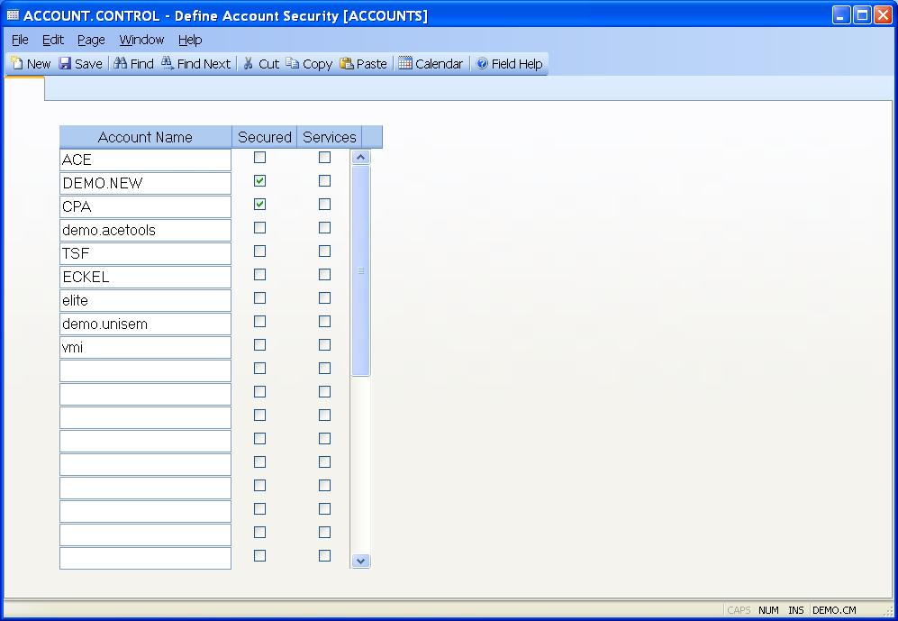

## Define Account Security (ACCOUNT.CONTROL)
<PageHeader />

##

| ****| The ID of this record is always defaulted by the system as "ACCOUNTS".

-  
**Account Name**|  Enter the name of each account on the system that you want
to set security on now or in the future. The accounts do not have to present
on the system at the time they are entered here.

**Secured**|  Check this box if the associated account is to be under the
control of security.

**Services**|  Check this box if services in the associated account are to be
started automatically during a system restart.

**Block**|  Check this box if users are to be blocked from logging into the
associated account. This only applies to users whose security profile is set
to "USER". Administrators and programmers are not blocked.

<badge text= "Version 8.10.57 " vertical="middle" /><PageFooter />
