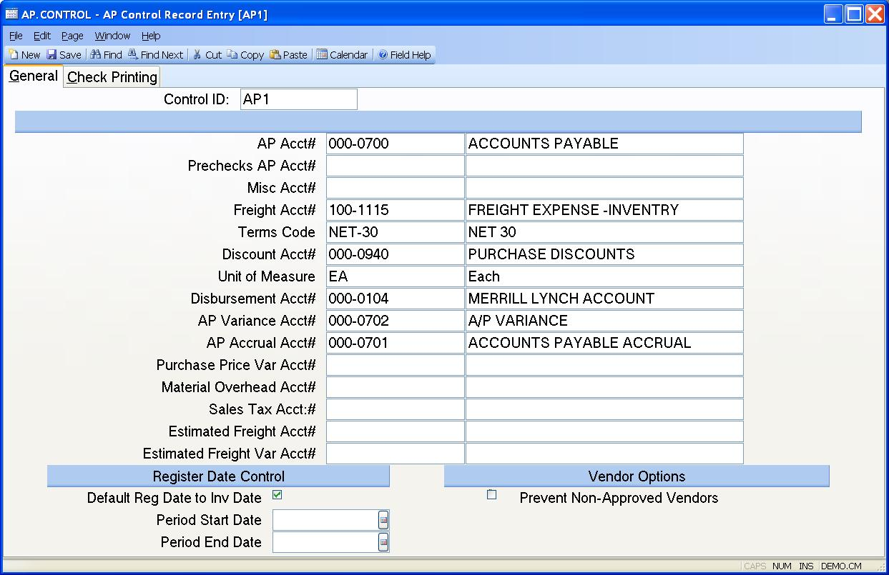

## AP Control Record Entry (AP.CONTROL)
<PageHeader />

## General

| **Control.ID**|  The control id is the company code (as defined on screen 2
of CO.CONTROL) preceded by "AP". If you only have one company code the control
id will automatically be inserted into this procedure for you. If you have
multiple company codes you may select from a list of available companies or
you may enter the id directly e.g. AP3. This record contains the default
information used in the AP module by company code.

-  
**AP Acct#**|  This is the default Account Payable account number used by the
[AP.E](../AP-E/README.md) procedure. This is loaded into the AP record automatically
and can be changed as required.

**Prechecks AP Account**|  When creating checks through
[CHECKS.E](../CHECKS-E/README.md), there is an option to create a check (i.e. a
precheck) without defining a A/P id or expense account. When using this
option, the system will create a debit AP.ID that can be viewed in
[AP.E](../AP-E/README.md). In this field, enter the A/P trade account that should be
posted to these debit A/P records. If no entry is made in this field, the
account referenced in the AP ACCT# field will be used.

**Misc Acct#**|  This field is used during [AP.E](../AP-E/README.md), when an amount is
entered in the Miscellaneous Amount field in the header screen. This account
number is defaulted and may be changed, as required.

**Freight Acct#**|  This account number is used as a default during
[AP.E](../AP-E/README.md), when an amount is entered in the Freight Amount field.

**Terms Code**|  The terms code entered in this field is used in
[AP.E](../AP-E/README.md) when a vendor has no default terms code entered.

**Discount Acct#**|  This account number is used in conjunction with the terms
discount applied in the header of [AP.E](../AP-E/README.md). An entry is made in the
APREG file only if the discount is actually taken during a check run, or on a
manual check.

**Unit of Measure**|  This field is used as a default in the line items of
[AP.E](../AP-E/README.md), when a part is entered which does not contain a unit of
measure.

**Disbursement Acct#**|  Enter the account number here for your cash account.
This is the account number which will be credited when a payment is made.

**AP Variance Acct#**|  This account number is used during the receipts
posting process (RECEITPS.P1), when an account number is either missing or
invalid, so that the entries in the register files will be in balance.

**AP Accrual Acct#**|  Enter the A/P Accrual General Ledger account number.
This account will be credited when receipts are posted in to the AP file.

**Purchase Price Var Acct#**|  This field is only used when standard costing
has been selected as the inventory cost method. When an item is received and
placed into inventory, and the price on the PO differs from the standard cost
in inventory, this account number is used to post the difference to General
Ledger.

**Material Overhead Acct#**|  If the decision has been made to apply a
material overhead to parts when they are received, the amount of overhead is
posted to the registers using this account number.

**Sales Tax Account**|  Enter the sales tax account number. This number must
exist in the GLCHART file. This account number will be used in certain AP
procedures in order to identify if the amount associated with an account
number is sales tax.

**Estimated Freight Account#**|  Enter the estimated freight account number.
This number must exist in the GLCHART file. This account number will be used
when estimated freight has been entered on purchase orders. The estimated
freight amount will be posted to this account when the AP record is created
for purchase receipts.

**Est Freight Var Acct#**|  This field is only used when standard costing has
been selected as the inventory cost method. When an item is received and
placed into inventory, and the estimated freight on the PO differs from the
standard freight cost in inventory, this account number is used to post the
difference to General Ledger.

**Default reg date**|  In [AP.E](../AP-E/README.md), the register date is defaulted to
the current system date. If you wish to have the register date default to the
invoice date, then set this field.

**Period Start Date**|  This field is used in conjunction with the period end
date and provides control over the entry of the register date in the AP
module. If present, any register date entered prior to the start date will
result in an error message being displayed. This field is used to control
dates when the General Ledger is either not being used, or not closed on a
timely basis.

**Period End Date**|  This field is used in conjunction with the period start
date and provides control over the entry of the register date in the AP
module. If present, any register date entered after the end date will result
in an error message being displayed. This field is used to control dates when
the General Ledger is either not being used, or not closed on a timely basis.

**Prevent Non-Approved Vendors**|  Check this box if only approved vendors can
be entered on new purchase orders, requisitions or, invoices. An exception to
this rule is invoices that will be created from purchase order receipts for
vendors that may have been approved at the time the purchase order was placed
but are no longer approved. A vendor is considered non-approved if a "Y" has
not been entered in the APPROVED field in the [VENDOR.E](../VENDOR-E/README.md) screen.
If this option is not selected a warning message will appear when entering
non-approved vendors but the users will still be able to add the vendor to the
order/invoice.

**Desc**|  This field contains the description of the associated account
number, as found in the GLCHART file.

**Precheck AP Account**|  This field contains the description of the
associated account number, as found in the GLCHART file.

**Desc**|  This field contains the description of the associated account
number, as found in the GLCHART file.

**Desc**|  This field contains the description of the associated account
number, as found in the GLCHART file.

**Terms Desc**|  This field contains the description of the associated terms
code, as found in the TERMS file.

**Desc**|  This field contains the description of the associated account
number, as found in the GLCHART file.

**UM Description**|  This field contains the description of the unit of
measure, as found in

**Desc**|  This field contains the description of the associated account
number, as found in the GLCHART file.

**Desc**|  This field contains the description of the associated account
number, as found in the GLCHART file.

**Desc**|  This field contains the description of the associated account
number, as found in the GLCHART file.

**Desc**|  This field contains the description of the associated account
number, as found in the GLCHART file.

**Desc**|  This field contains the description of the associated account
number, as found in the GLCHART file.

**Desc**|  This field contains the description of the associated account
number, as found in the GLCHART file.

**Desc**|  This field contains the description of the associated account
number, as found in the GLCHART file.

**Desc**|  This field contains the description of the associated account
number, as found in the GLCHART file.

<badge text= "Version 8.10.57 " vertical="middle" />

<PageFooter />
