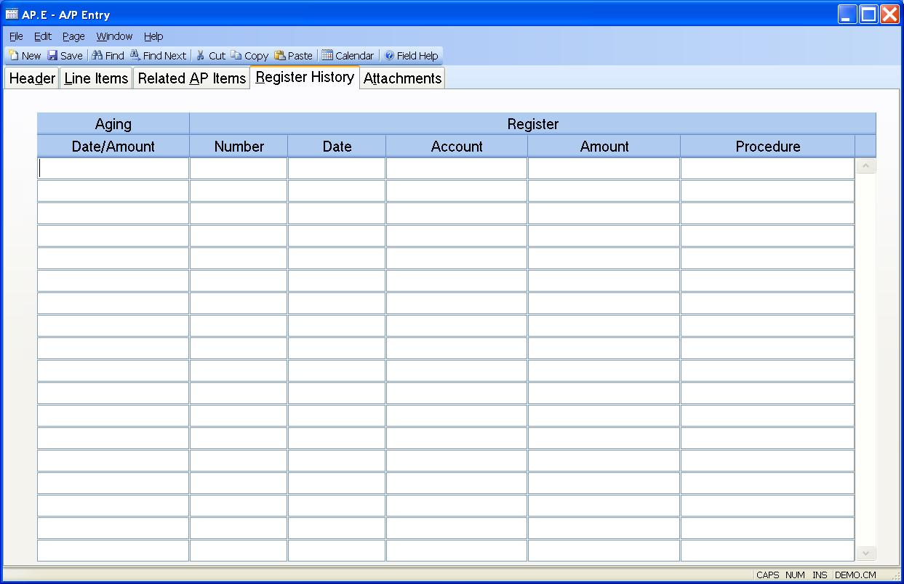

## A/P Entry (AP.E)
<PageHeader />

## Register History

| **Date/Amount**|  Contains the dates and amounts for each change to the AP
record that resulted in an entry to the AP register file.

-  
**Register Number**|  Contains the number of each register associated with the
AP record.

**Register Date**|  The date of each of the register records.

**Register Account**|  The account number to be posted for the register
record.

**Register Amount**|  The dollar amount of the register record.

**Procedure**|  The name of the procedure that created the register record.

<badge text= "Version 8.10.57 " vertical="middle" />

<PageFooter />
