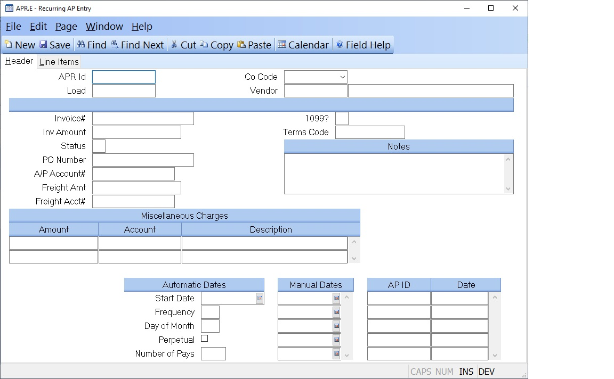

## Recurring AP Entry (APR.E)
<PageHeader />

## Header

| **APR Id**|  If you wish to access an A/P record which already exists, enter
that number. If you wish to enter a new A/P record, you may either enter a ne
ID now, or leave this field null to assign a new A/P ID when the record is
filed.

-  
**Co Code**|  Enter the company code you want this record applied against. The
company code must be predefined in the CO.CONTROL procedure.

**Vendor**|  Enter the vendor number to whom the amount is owed. The vendor
number must exist on the
Vendor file. If you do not know the vendor's number, there is an option in the
help menu for
this prompt which allows you to select a vendor by entering the vendor's name.

**Invoice#**|  Enter the number of the invoice received from the vendor. If
this number is not present, the record is treated as an accrual for goods or
services received which have not yet been invoiced.

**Inv Amount**|  Enter the net amount of the invoice. This is the actual
amount owed to the vendor. The amount entered here must equal:
Total of all line item amounts
\+ Miscellaneous amounts
\+ Freight

**Status**|  This is a system controlled field indicating the status of this
APR item: O = Open C = Closed /

**PO#**|  Enter the purchase order number against which this A/P record is
being entered. This is an optional field. If this record was created
automatically by the Purchasing/Receiving process, this number will already be
present.

**AP Acct#**|  Enter the G/L account number against which this A/P record will
be charged. This account number is defaulted from the [AP.CONTROL](../AP-
CONTROL/README.md) file and can be changed if necessary.

**Freight Amt**|  Enter the freight amount which is being charged on this
invoice.

**Freight Acct#**|  Enter the G/L account number to which the freight amount
is being charged.

**1099**|  Enter a "Y" if this item should be included on a 1099 report for
this vendor. This field is defaulted from the Vendor file, but can be changed
if required.

**Terms Code**|  Enter the terms code which identifies the terms the vendor
agreed to for this A/P record. This is defaulted from the Vendor file and can
be changed for each invoice as required.

**Notes**|  Enter any notes which apply to this A/P item.

**Misc Amounts**|  Enter any miscellaneous amounts which have been added to
the invoice. This field is multi-valued and can contain any number of amount,
associated with the miscellaneous descriptions and account numbers.

**Misc Acct#**|  Enter the account number to which the miscellaneous amount is
being distributed.

**Misc Desc**|  Enter a brief description of the charge(s) being added to the
invoice.

**Start Date**|  Enter the first date on which an A/P record is to be created.

**Frequency**|  You may specify the frequency at which a payment is to be
generated using this field. For example, if you want a quarterly payment
(every 3 months) you would enter the number 3. If no entry is made 1 is
assumed.

**Day of Month**|  Enter the day of the month on which the A/P record is to be
generated from this recurring record. For example, if you want to generate an
invoice on the 10th of each month, enter 10 here.

**Perpetual**|  Check this box if the payments are to be created indefinitely.
This entry will be ignored if there is an entry in the Number of Pays field or
there are entries in the Manual Dates field.

**Number of Pays**|  Enter the number of times this recurring record should
create an A/P record. For example, if this record is being entered to pay a
monthly bill over the course of a year, enter 12.

**Manual Dates**|  If you want to specify a specific set of payment dates you
may enter each date in this field. The presence of dates in thsi field will
override any automatic settings that may be present.

**AP Ids**|  Displays the list of all AP records that have been generated from
the recurring definition.

**Ap Dates**|  Displays the date on which the associated AP record invoice was
set when created.

**Vendor Name**|  This is the vendor name as read from the Vendor file.

<badge text= "Version 8.10.57 " vertical="middle" />

<PageFooter />
