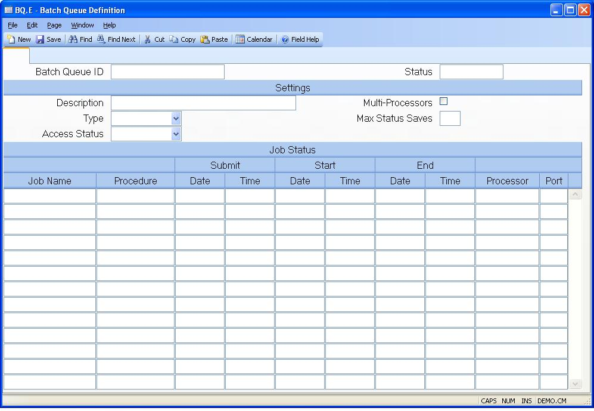

## Batch Queue Definition (BQ.E)
<PageHeader />

##

| **Batch Queue ID**|  Enter the ID by which this batch queue will be
referenced.

-  
**Status**|  Displays the word "Active" if the queue is currently being
processed, or "Inactive" if it is not.

**Description**|  Enter a brief description of the purpose of this batch
queue.

**Type**|  Enter one of the following codes which defines the batch queue
type.

Administrator
Used primarily by the system administrator
for setting up permanent queues which will
always contain the same entries. This type
of queue is not available for users to add
jobs.

Public
This type of queue is available for users
to add jobs.

**Access Status**|  This field determines if users may add new jobs to the
queue. The following options are available.
Open
Permits users to add jobs to the queue.
Closed
Prevents users from adding jobs to the queue.

**Multi Processors**|  This checkbox determines if the batch queue may be
processed by more than one batch execution process at the same time. If
checked then multiple processors will be permitted to execute items in the
queue. This option should not be checked if the items specified in the queue
must be run in sequential order.

**Max Status Saves**|  The number in this field controls how much of the job
status information is to be retained. For example, if this field were set to
10 then the information from the last ten jobs which were executed would be
retained.

**Job ID**|  Enter the name of each job to be run when this queue is processed
in the order they are to be run. You would probably leave this field empty for
most public queues since these are usually created to accept user jobs. The
help menu for this prompt has an option which allows you to display all of the
status messages generated when the job was processed.

**Job Name**|  Contains the name of the procedure which will be run when the
job is executed.

**Job Submit Date**|  Contains the date on which the job was submitted to this
queue for processing. This field contains data only if the job was submitted
by a user process. The field is null for items entered with BQ.E.

**Job Submit Time**|  Contains the time at which the job was submitted to this
queue for processing. This field contains data only if the job was submitted
by a user process. The field is null for items entered with BQ.E.

**Job Start Date**|  Contains the date on which the processing for the
associated job began.

**Job Start Time**|  Contains the time at which the processing for the
associated job began.

**Job End Date**|  Contains the date on which the processing for the
associated job was completed.

**Job End Time**|  Contains the time at which the processing for the
associated job completed.

**Batch Execution ID**|  Contains the ID of the batch execution record that
processed the associated job.

**Batch Execution Line**|  Contains the line number on which the associated
batch execution procedure processed the associated job.

<badge text= "Version 8.10.57 " vertical="middle" />

<PageFooter />
