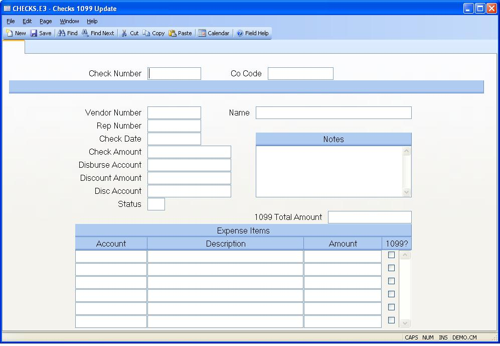

## Checks 1099 Update (CHECKS.E3)
<PageHeader />

##

| **Check#**|  Enter the check number which you want to update for notes or
1099 data.

-  
**Co.Code**|  The company code for this check.

**Vendor#**|  The vendor number to which the check is being paid.

**Name**|  The name of the vendor or rep to which the check is being paid.

**Rep Id**|  The rep number to which the check is being paid.

**Check.Date**|  Enter the date which appears on the check.

**Check.Amt**|  The amount for which the check was issued.

**Disb.Acct#**|  The G/L account number from which this check is being paid.

**Disc.Amt**|  The amount of discount which was taken on this check.

**Disc.Acct#**|  The G/L account number which is being credited for the
discount amount.

**Status**|  The status of this check record. P = Posted V = Void S = Stop
Payment C =

**Notes**|  Enter any notes applicable to this check.

**Amount for 1099**|  This is the total expense amount flagged for 1099
reporting as recorded in the 1099 file. It is based on the amounts flagged
below and/or the vendor and rep 1099 settings. If the 1099 amount needs to be
manually adjusted, enter the new amount here. This amount will be recorded on
the 1099 file for the year. The 1099 file must be generated before this amount
can be adjusted.

**Expense Acct**|  The expense account for the associated amount.

**Acct.Desc**|  This field contains the description of the GL account.

**Expense Amt**|  Enter the expense amount for the associated account number.

**1099**|  Check here if this expense item will be included in 1099 reporting
for the vendor or rep. If this check number is not related to a vendor or rep
number, then this box cannot be checked.

<badge text= "Version 8.10.57 " vertical="middle" />

<PageFooter />
