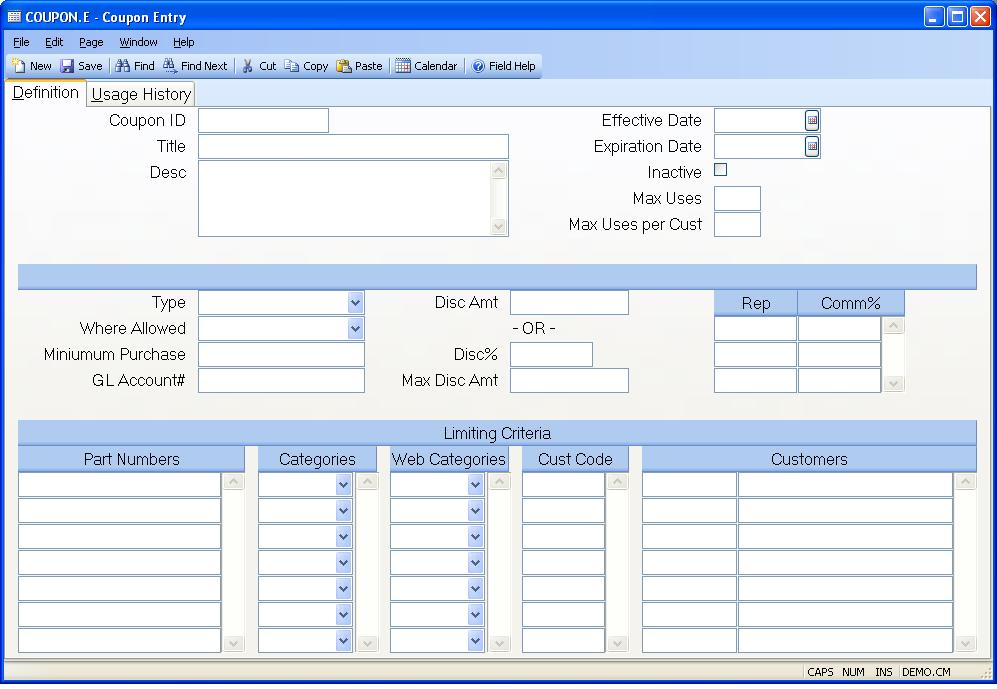

## Coupon Entry (COUPON.E)
<PageHeader />

## Definition

| **ID**|  Enter the coupon id or leave blank to have the system assign the
next sequential number.

-  
**Title**|  Enter a brief title or description for the coupon.

**Desc**|  Enter a more detailed description of the coupon if desired.

**Eff Date**|  Enter the date the coupon is effective. If no date is entered,
the coupon is effective immediately.

**Exp Date**|  Enter the expiration date of the coupon. If no date is entered,
the coupon is effective indefinately or until maximum number of uses has been
reached.

**Inactive**|  Check this box to inactivate this coupon.

**Max Uses**|  The maximum number of uses(orders) allowed for this coupon.

**Max Per Cust**|  The maximum number of uses(orders) per customer allowed for
this coupon.

**Type**|  Enter the type of coupon:
1) Stackable
2) Non-stackable
3) Exclusive

For a detailed description of the rules regarding the different types, see the
procedure help.

**Where Allowed**|  Enter where this coupon is allowed to be used. The default
is for all orders.

**Min Order Amt**|  Enter the minimum order amount that must be met in order
for this coupon to be applied to a particular sales order. This is an optional
entry.

**Account**|  Enter the GL account# that will be charged for the resulting
coupon discount amount. This account and amount will appear on the shipment as
a negative miscellaneous charge.

**Disc Amt**|  Enter the discount amount for this coupon. Alternatively, a
discount percent can be specified.

**Disc Pct**|  Enter the discount percent for this coupon. Alternatively, a
discount amount can be specified.

**Max Disc Amt**|  Enter the maximum discount amount that would apply to an
individual order. This would only be entered if a discount % is entered and is
an optional entry.

**Rep**|  Enter any rep(s) that would be receiving a commission as a result of
using this coupon. This will apply to web orders only.

**Comm**|  Enter the commission % that the associated rep is to receive if
this coupon is used.

**Parts**|  Enter any part numbers that this coupon would be limited to. Leave
blank if it applies to all parts.

**Category**|  Enter any part categories that this coupon would be limited to.
Leave blank if it applies to all categories.

**Web Category**|  Enter any part categories that this coupon would be limited
to. Leave blank if it applies to all categories.

**Cust Code**|  Enter any customer price codes that this coupon would be
limited to. Leave blank if it applies to all codes.

**Cust**|  Enter any customer numbers that this coupon would be limited to.
Leave blank if it applies to all customers.

**Cust Name**|  The customer name for the associated customer number.

<badge text= "Version 8.10.57 " vertical="middle" />

<PageFooter />
