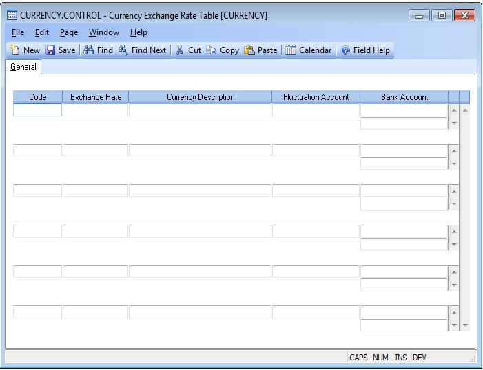

## Currency Exchange Rate Table (CURRENCY.CONTROL)
<PageHeader />

## General

| **Control ID**|

-  
**Currency Code**|  Enter a code to designate a particular currency. This code
will be used in order entry and other procedures.

**Exchange Rate**|  Enter the exchange rate for the value of the currency
versus your base currency (i.e. dollars). This number will be used as a factor
to be multiplied by the base currency price to get the foreign currency price.
If entering the foreign currency, it will be divided into that number to
derive the dollar price.

**Description**|  Enter the description of the currency code. This is an
optional entry.

**Fluctuation**|  Enter the general ledger account number that will be used
when processing deposits or payments in a foreign currency. Dollars will be
posted to the account for the difference between the foreign amount and the
USD amount.

**Bank Account**|  Enter the general ledger account(s) that represent the
foreign bank accounts.

<badge text= "Version 8.10.57 " vertical="middle" />

<PageFooter />
