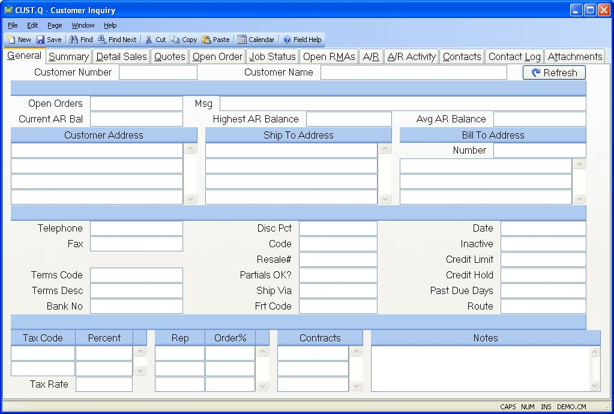

## Customer Inquiry (CUST.Q)
<PageHeader />

## General

| **Customer Number**|  Enter a valid customer number. If you want to access a
customer but you do not know the
number, there is an option in the help menu for this prompt which allows you
to select the
customer by name, purchase order or phone number.

-  
**Customer Name**|  The name of the customer. The name will display after the
customer number has been entered for verification.

**Open Order Balance**|  The current open order amount for the customer that
will be billed for the open orders. This customer may not be the same as the
customer who authorized and/or issued the purchase order for the parts and/or
services. When checking a customer's available credit, the system looks at the
open order amount for the customer who will be paying for the order.
Therefore, the system maintains the open order amount by bill to customer.
Please note that the open orders that appear on another tab in this procedure
are for the customer that approved the order and not the customer that will be
invoiced.

**Accts Recv Balance**|  The current AR balance.

**Credit Warning**|  Credit warning if this customer has issues.

**Customer Address**|  The complete address for this customer.

**Ship To Address**|  This field contains the multiple ship addresses for the
customer.

**Bill To Customer**|  The number of the customer who will be billed for
orders placed by this customer. If this field is null, the sold to and the
bill to are assumed to to be the same.

**Bill To Address**|  If a bill to customer number is present, the name and
address are displayed here for veri- fication purposes.

**Telephone**|  The customer's telephone number.

**Fax Number**|  The telephone number to use for sending facsimiles to the
customer.

**Terms Code**|  The standard terms code.

**Terms Desc**|  Contains the description of the associated terms code.

**Bank No**|  This field contain's the bank's internal id number for the
primary checking account this customer will issue checks from.

**Discount Pct**|  The default discount percent.

**Code**|  The user defined code for this customer. This code is used for
product pricing structures defined in [PRICE.E](../PRICE-E/README.md).

**Resale#**|  The customers resale number.

**Partials OK?**|  A "Y" indicates partial shipments are allowed by the
customer. An "N" or null field indicates the customer does not allow partials.

**Ship Via**|  The normal method of shipping.

**Freight Code**|  This field contains the normal method of payment - prepaid,
collect or third party - for freight charges:

**Date**|  This field contains the date which this customer started.

**Inactive Date**|  This field contains the date the customer's account became
inactive on.

**Credit Limit**|  The maximum credit limit granted to this customer.

**Credit Hold**|  A "Y" in this field indicates that the customer is on credit
hold. If the credit hold is set then the operator will be warned in sales
order entry that the customer is on credit hold, and will be asked if the
sales order they have entered should be placed on hold. Shipments for this
customer cannot be processed when this box is checked. Note:This customer must
be the bill to customer for the credit hold to take effect.

**Past Due Days**|  This field contains the number of days the customer can be
past due on paying any invoices before an order will be placed on hold.

**Route Id**|  This field contains the delivery route to which this customer
is assigned.

**Sales Tax Code**|  The sales tax code assigned to this customer.

**Tax Pct**|  The percent of sales tax as read from the STAX file.

**Tax Rate**|  The default tax rate.

**Rep**|  The rep number(s) assigned to this customer.

**Order%**|  The order percent for each rep.

**Contract Id**|  Any price contracts that apply to this customer are
displayed here. The contract pricing and commission will override any standard
pricing and commission defaults.

**Refresh**|  Click this button to display the most current information for
the customer currently being displayed.

**Notes**|  Notes regarding the customer which are loaded into all new sales
order records. It may be updated in [CUST.E](../CUST-E/README.md).

**Highest AR Bal**|  This is the highest AR balance for the time period
specified in [ACCT.CONTROL](../ACCT-CONTROL/README.md).

**Avg AR Balance**|  This is the average AR daily balance for the time period
specified in [ACCT.CONTROL](../ACCT-CONTROL/README.md), excluding zero balances.

<badge text= "Version 8.10.57 " vertical="middle" />

<PageFooter />
