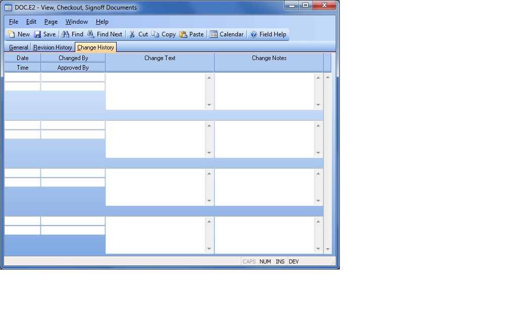

## View, Checkout, Signoff Documents (DOC.E2)
<PageHeader />

## Change History

| **Change Date**|  The date the document record was changed.

-  
**Change Time**|  The time the document record was changed.

**Changed By**|  The User ID of the person who changed the document.

**Approved By**|  The approver of the document change, if entered by the user.

**Change Text**|  This is change text that is generated by the system based on
what was changed when the record was saved.

**Change Notes**|  Any notes associated with changes made on this date and
time as entered by the user.

<badge text= "Version 8.10.57 " vertical="middle" />

<PageFooter />
