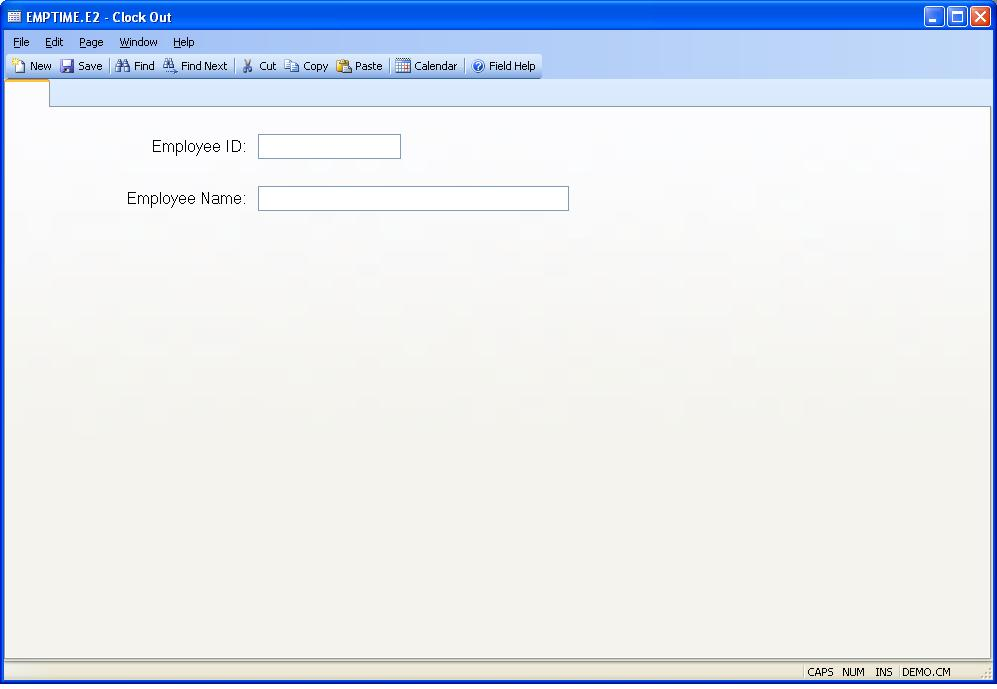

## Clock Out (EMPTIME.E2)
<PageHeader />

##

| **Employee ID**|  Enter the number which identifies the employee to be
clocked-out.

-  
**Employee Name**|  Contains the name of the employee entered.

<badge text= "Version 8.10.57 " vertical="middle" />

<PageFooter />
