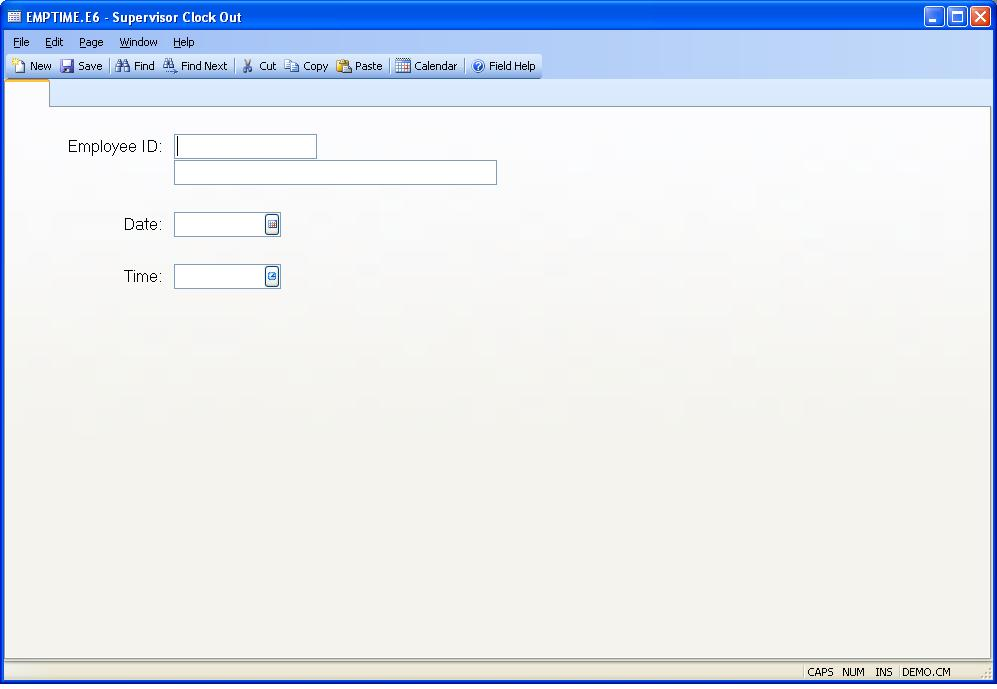

## Supervisor Clock Out (EMPTIME.E6)
<PageHeader />

##

| **Employee ID**|  Enter the number which identifies the employee to be
clocked out.

-  
**Employee Name**|  The name of the above employee.

**Date**|  The date to be used for clocking out the employee.

**Time**|  The time used for clocking out the employee.

<badge text= "Version 8.10.57 " vertical="middle" />

<PageFooter />
