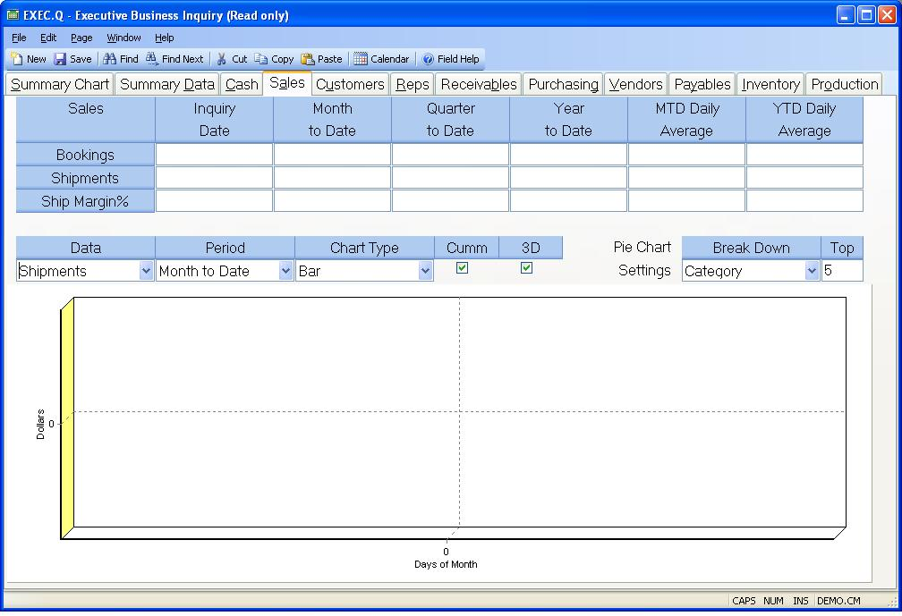

## Executive Business Inquiry (EXEC.Q)
<PageHeader />

## Sales

| **Bookings**|  Displays the booking information for the day, month to date,
quarter to date, year to date and daily averages.

-  
**Shipments**|  Displays the shipment information for the day, month to date,
quarter to date, year to date and daily averages.

**Ship Margin Percent**|  Displays the shipment margin percent for the day,
month to date, quarter to date, year to date and daily averages.

**Data Type**|  Indicate the source of the data to be used in the chart.
Options are Bookings and Shipments.

**Period**|  Indicate the period of time to be used in the chart. Options are
Month to Date and Year to Date.

**Chart Type**|  Indicate the type of chart to be displayed. Options are Area,
Bar and Line.

**Cumm**|  Check this box if the data is to be shown as a cummulative number
over the period of time specified.

**3D**|  Check this box if the information is to be displayed in three
dimentional format.

**Break Down**|  Indicate which attribute should be broken out in the pie
chart for the data and period specified. Options are Category, Customer, Sales
Rep and Sales Type.

**Top**|  The pie chart will break out a section for each customer, category,
sales rep or sales type. Instead of showing a separate section for each you
can indicate that only the top X in the grouping be shown with the rest
included under "Other".

**Sales Period Chart**|  Displays the chart for the period and type of data
specified.

<badge text= "Version 8.10.57 " vertical="middle" />

<PageFooter />
