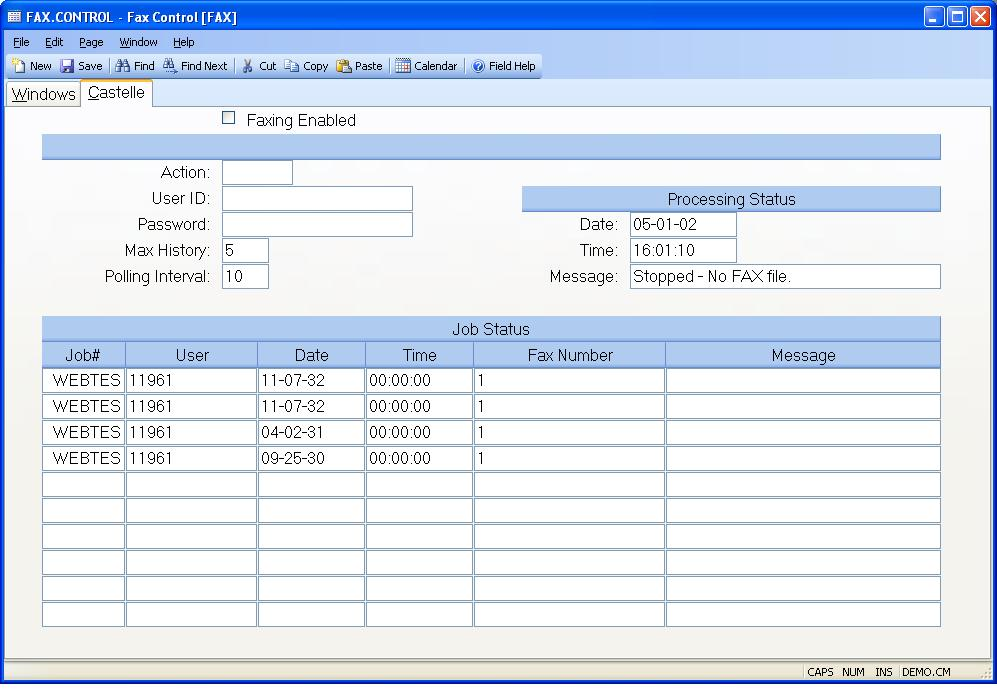

## Fax Control (FAX.CONTROL)
<PageHeader />

## Castelle

| **Faxing Enabled**|  Check this box if users are allowed to use the faxing
function. You must have a FaxPress server installed for this capability.

-  
**Action**|  Enter one of the following actions to be taken:
START - Launches the fax process as a phantom
STOP - Causes the process to stop
RESET - Resets abnormally terminated

**User Id**|  Enter the user id to be used for logging on the fax process.
This user must be defined in the SECURITY.E procedure with login rights to the
ACE account.

**Password**|  Enter the password for the user id. If a user id was entered
previously then a string of six asterisks (*) will appear. To change the
password replace the asterisks with the correct password.

**Max History**|  Enter the number of completed jobs to be maintained in the
job queue list before they are deleted.

**Polling Interval**|  Enter the number of seconds the fax process should wait
between checking for new faxes to be sent.

**Status Date**|  Contains the date that the last status message was received
from the fax process.

**Status Time**|  Contains the time at which the last status was received from
the fax process.

**Status Message**|  Contains the last status message received from the fax
process.

**Job Number**|  Contains the numbers assigned to the jobs that are being
processed, are waiting to be processed or have been completed and are within
the maximum history setting.

**User Id**|  The ID of the user that submitted the job.

**Submit Date**|  The date on which the job was submitted.

**Submit Time**|  The time at which the job was submitted.

**Fax Number**|  The telephone number of the destination fax.

**Job Status**|  Contains the current status of the job.

<badge text= "Version 8.10.15 10/27/14" vertical="middle" />

<PageFooter />
