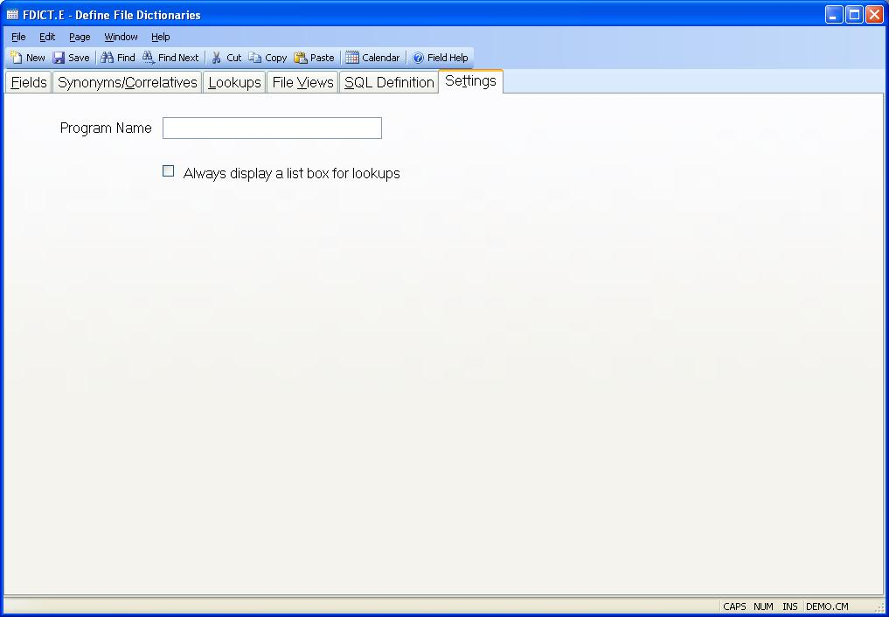

## Define File Dictionaries (FDICT.E)
<PageHeader />

## Settings

| **Program Name**|  If a field in a data entry procedure references the file
defined by the FDICT record,
the program name identified in this field will be called after the user enters
data. This program is called before the standard procedure validation and
after input call. It can be used to validate an entry so that this code does
not need to be created for every procedure that calls the field. For example,
the CUST file could have a program called P$CUST that validates the entry as a
valid customer number. In addition you could have this program check first for
a valid record in the CUST file and if not found check the entry against the
customer name, display a list of options, allow the user to select a customer
number, and set A$ENTRY equal to the customer number selected. If additional
processing is to be done using the record read from the file in the after
input logic of the program called from the procedure, you can put the record
read by this program into a variable called A$FDICT.CALL.REC which is
available through common to the application program.

-  
**Show Lookup List**|  When a lookup is triggered and only one item is found
the system returns this as the item selected without displaying a list of
items to the user. Check this box if the list is to be displayed even when
only one item is returned.

<badge text= "Version 8.10.57 " vertical="middle" />

<PageFooter />
