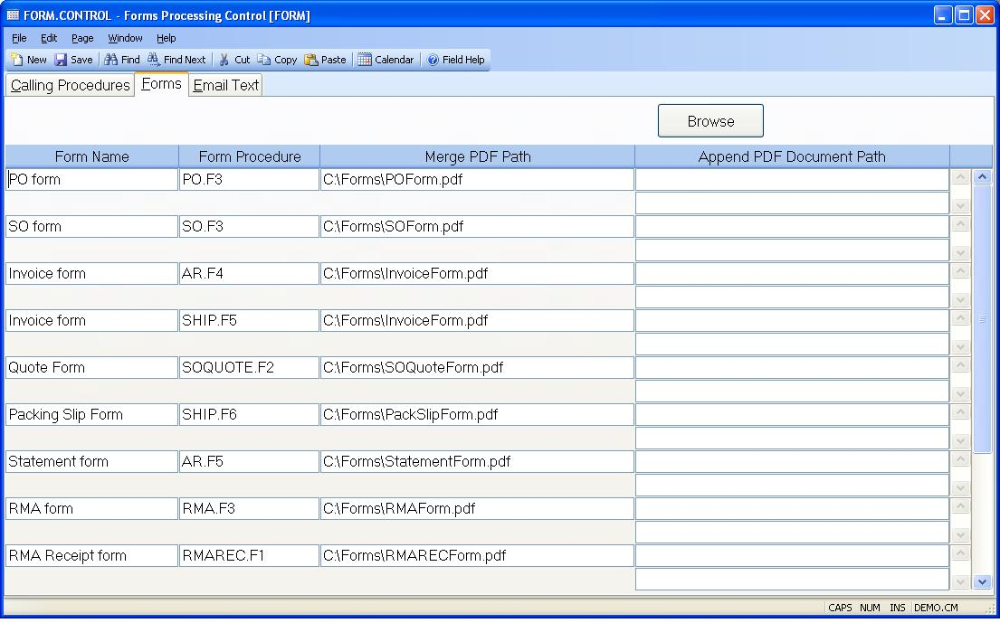

## Forms Processing Control (FORM.CONTROL)
<PageHeader />

## Forms

| **Form Name**|  Enter the name you want to assign to the associated
properties that define a form and attachments. This name is used by the data
entry procedures defined on the Calling Procedures page to identify the output
options available to the user when they use the procedure. Note: These entries
only apply to forms that utilize a PDF file for the form layout and/or
attachments.

-  
**Procedure Name**|  Enter the name of the procedure that the merge and
attachment forms are being associated with.

**Merge PDF Path Page 1**|  Enter the full path to the PDF form that will be
used as the form for the associated procedure for the first page. If nothing
is defined for the second and subsequent pages the form defined here will be
used on all pages. Make sure this path is accessible to all users that may run
the procedure.

**Merge PDF Path Page 2**|  Enter the full path to the PDF form that will be
used as the form for the associated procedure on the second and subsequent
pages . Make sure this path is accessible to all users that may run the
procedure.

**Append PDF Document Path**|  Enter the full paths to the PDF forms that will
be appended to the document when it is processed. Make sure this path is
accessible to all users that may run the procedure.

**Browse**|  Click this button to select the path to be placed in the current
field.

<badge text= "Version 8.10.57 " vertical="middle" />

<PageFooter />
