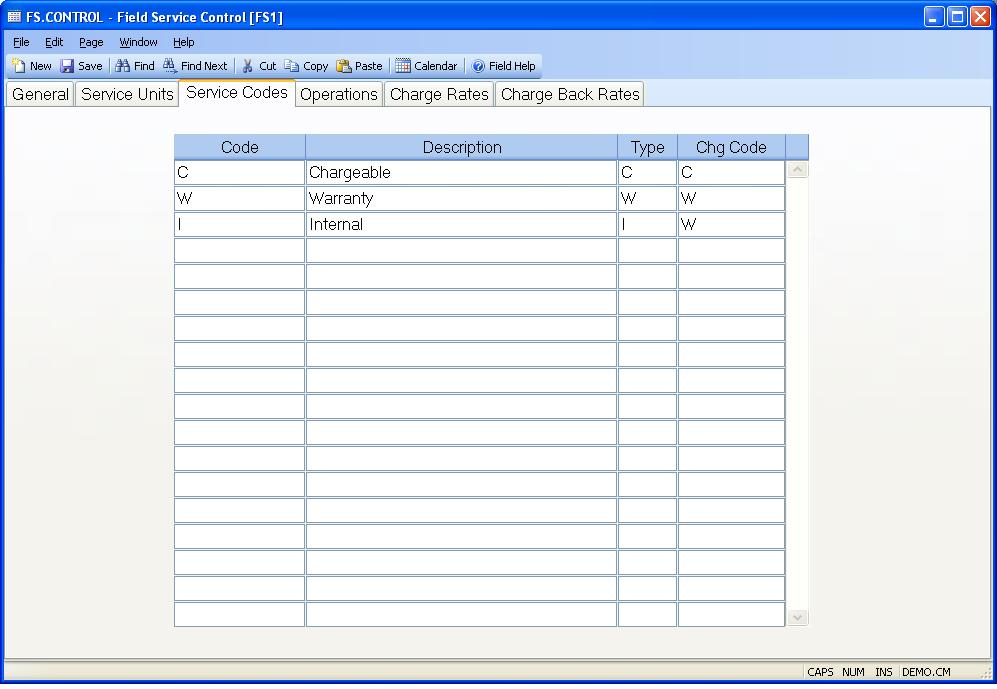

## Field Service Control (FS.CONTROL)
<PageHeader />

## Service Codes

| **Service Code**|  Enter all of the service codes available for use in the
service orders.

-  
**Code Description**|  Enter the description of the associated service code.

**Job Type**|  Enter one of the following codes defining how the associated
service code will be charged.
C - Chargeable to the customer
I - Billed as an internal charge.
W - Manufacturer warranty (chargeback)

**Charge Code**|  Enter the charge code to be used in association with the
service code. These codes are defined on another tab in this procedure.

<badge text= "Version 8.10.57 " vertical="middle" />

<PageFooter />
