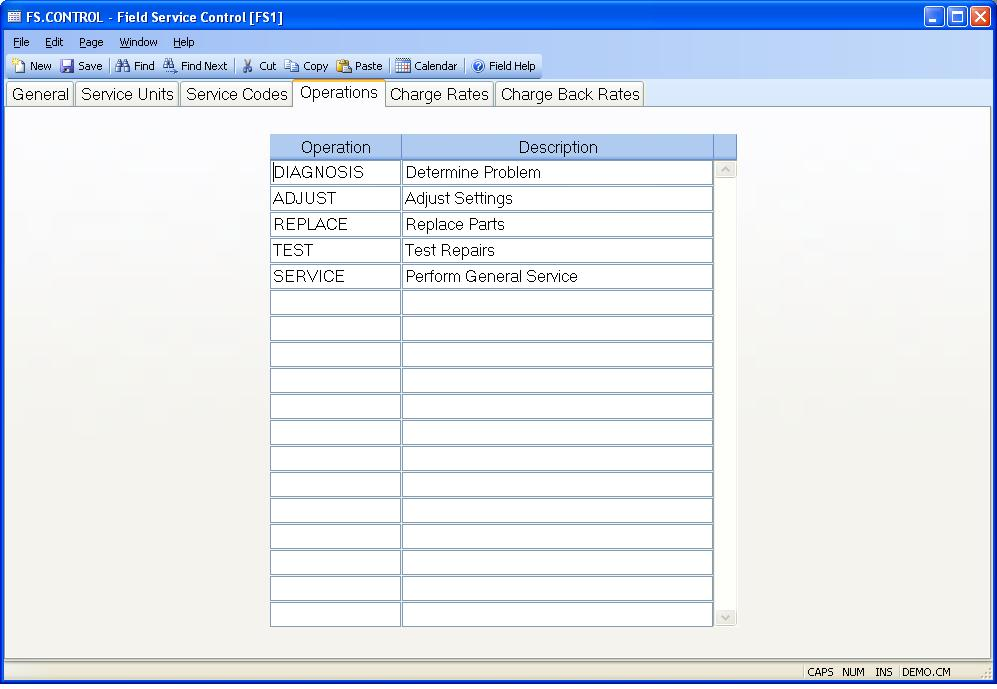

## Field Service Control (FS.CONTROL)
<PageHeader />

## Operations

| **Operation**|  Enter each operation code that is available for use in
service orders.

-  
**Operation Description**|  Enter a description of the associated service
code.

<badge text= "Version 8.10.57 " vertical="middle" />

<PageFooter />
