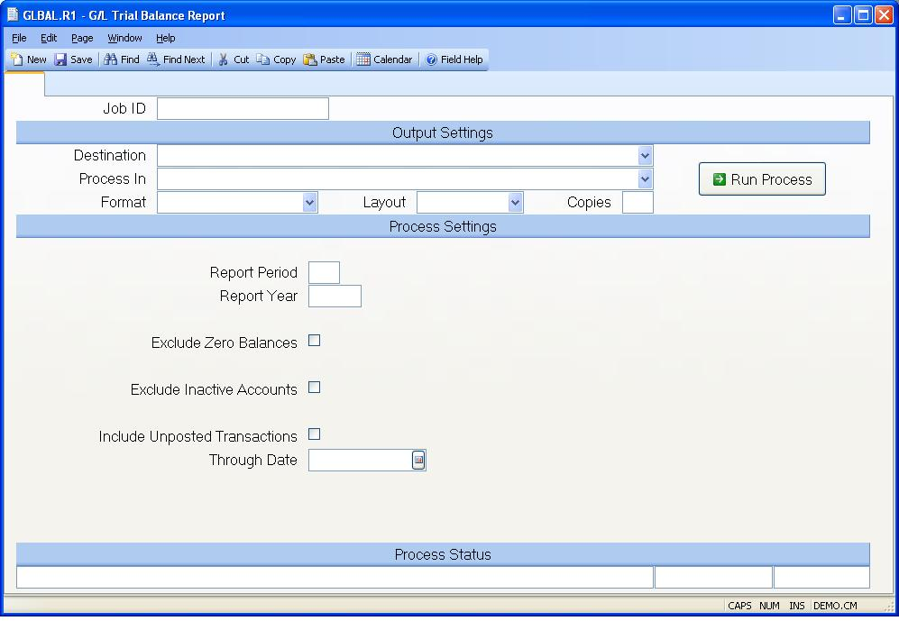

## G/L Trial Balance Report (GLBAL.R1)
<PageHeader />

##

| **Job ID**|  Enter a unique ID if you wish to enter and save the parameters
to this procedure for future use. If you only need to run the procedure and do
not want to save your entry then you may leave this field empty.

-  
**Destination**|  Select the destination for the output from this procedure.

**Process**|  Select the method to be used for processing the report.
Foreground is always available and must be used when output is directed to
anything other than a system printer (i.e. printers spooled through the
database on the host computer.) Depending on your setup there may be various
batch process queues available in the list that allow you to submit the job
for processing in the background or at a predefined time such as overnight. A
system printer must be specified when using these queues.

**Format**|  Select the format for the output. The availability of other
formats depends on what is allowed by each procedure. Possible formats include
Text, Excel, Word, PDF, HTML, Comma delimited and Tab delimited.

**Layout**|  You may indicate the layout of the printed page by specifying the
appropriate setting in this field. Set the value to Portrait if the page is to
be oriented with the shorter dimension (usually 8.5 inches) at the top or
Landscape if the longer dimension (usually 11 inches) is to be at the top.
Portrait will always be available but Landscape is dependent on the output
destination and may not be available in all cases.

**Copies**|  Enter the number of copies to be printed.

**Run Process**|  Click on the button to run the process. This performs the
save function which may also be activated by clicking the save button in the
tool bar or pressing the F9 key or Ctrl+S.

**Report Period**|  Enter the fiscal period for which you wish to run the
trial balance. This field will default to the report period which is in the
GL.CCONTROL record.

**Report Year**|  Enter the fiscal year for which you wish to run this report.
The entry will default to the year contained in the [GL.CONTROL](../GL-
CONTROL/README.md) record.

**Exclude Zero Balances**|  Check this box to exclude zero balances from
printing on the report.

**Exclude Inactive**|

**Include Unposted Registers**|  Check this box if register records and
journal entries that are not posted through the period are to be included in
the report. Note: all unposted records from the beginning of the fiscal year
through the end of the period being reported will be included, not just the
unposted records for the reporting period. Choosing this option will likely
cause a substantial increase the amount of time required to process the
report.

**Through Date**|  Enter the date through which unposted register records are
to be included. This only applies when the "Include Unposted Registers" box is
checked. If no date is specified then the end date for the period is used.

**Last Status Message**|  Contains the last status message generated by the
program.

**Last Status Date**|  The date on which the last status message was
generated.

**Last Status Time**|  The time at which the last status message was
generated.

<badge text= "Version 8.10.57 " vertical="middle" />

<PageFooter />
