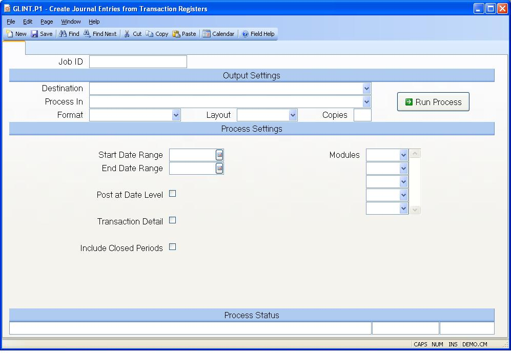

## Create Journal Entries from Transaction Registers (GLINT.P1)
<PageHeader />

##

| **Job ID**|  Enter a unique ID if you wish to enter and save the parameters
to this procedure for future use. If you only need to run the procedure and do
not want to save your entry then you may leave this field empty.

-  
**Destination**|  Select the destination for the output from this procedure.

**Process**|  Select the method to be used for processing the report.
Foreground is always available and must be used when output is directed to
anything other than a system printer (i.e. printers spooled through the
database on the host computer.) Depending on your setup there may be various
batch process queues available in the list that allow you to submit the job
for processing in the background or at a predefined time such as overnight. A
system printer must be specified when using these queues.

**Format**|  Select the format for the output. The availability of other
formats depends on what is allowed by each procedure. Possible formats include
Text, Excel, Word, PDF, HTML, Comma delimited and Tab delimited.

**Layout**|  You may indicate the layout of the printed page by specifying the
appropriate setting in this field. Set the value to Portrait if the page is to
be oriented with the shorter dimension (usually 8.5 inches) at the top or
Landscape if the longer dimension (usually 11 inches) is to be at the top.
Portrait will always be available but Landscape is dependent on the output
destination and may not be available in all cases.

**Copies**|  Enter the number of copies to be printed.

**Run Process**|  Click on the button to run the process. This performs the
save function which may also be activated by clicking the save button in the
tool bar or pressing the F9 key or Ctrl+S.

**Start Date Range**|  This is the start date to be used in selecting which
register records are to be include in the G/L posting. If you leave the date
blank then any transaction up to the end date (if present) will be included.

**End Date Range**|  This is the end date to be used in selecting which
register records are to be included in the G/L posting. If left blank then any
transactions greater than or equal to the start date (if present) will be
included.

**Post at Date Level**|  Check this box if you want a separte entry posted for
each transaction date. Leave the box unchecked if all the transactions within
a period are to be summarized into one entry.

**Transaction Detail**|  Check this box if you want a separate transaction
posted for each posting type. Leave the box unchecked if the posting is to be
summarized by account. The posting types are defined in the [GL.CONTROL](../GL-
CONTROL/README.md) procedure.

**Include Closed Periods?**|  Check this box, if you wish to include unposted
register records that are for a closed fiscal period.

**Modules**|  Enter the module identifier which corresponds to the module(s)
you wish to interface to the General Ledger. This field is defaulted from the
[GL.CONTROL](../GL-CONTROL/README.md) record.

**Last Status Message**|  Contains the last status message generated by the
program.

**Last Status Date**|  The date on which the last status message was
generated.

**Last Status Time**|  The time at which the last status message was
generated.

<badge text= "Version 8.10.57 " vertical="middle" />

<PageFooter />
