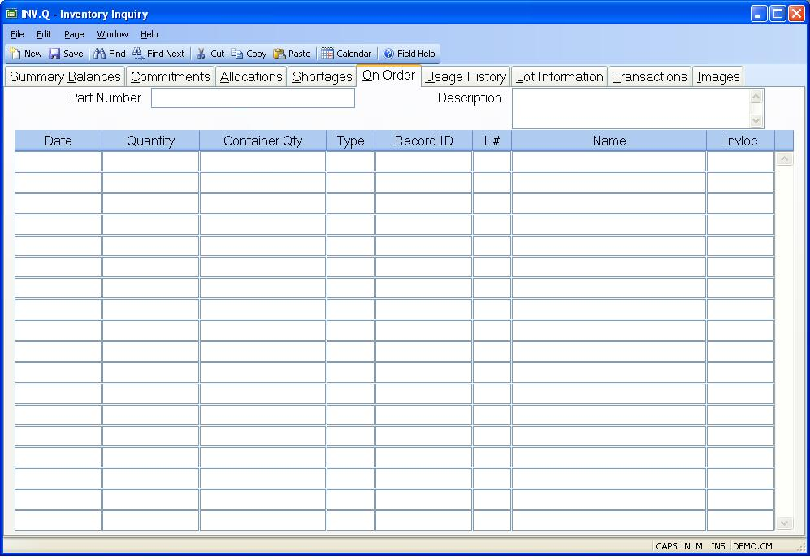

## Inventory Inquiry (INV.Q)
<PageHeader />

## On Order

| **Date**|  The date for which there is an on order of this part. For
purchase orders, this is the scheduled receipt date, and for work orders the
completion date.

-  
**Qty**|  The quantity of this part which is on order for the associated date.

**Container Qty**|  This is the container quantity in-transit for this PO line
item. To see container number, use the added help option for this prompt.

**Type**|  The type of order to which this part is on order.

**ID**|  The order number against which the items are on order.

**Li**|  The line item number on the order which contains this part number.

**Name**|  The vendor with whom the items are on order if the order type is
"PO".

A purchase order and line item number will appear in this field if the order
type is "WO" and the work order was generated for a purchase order with the
same part number as the work order.

**Invloc**|  The inventory location against which the inventory on order was
made.

**Part Number**|  The part number for which you are seeing the on order data.

**Description**|  Contains the description of the part number selected.

<badge text= "Version 8.10.57 " vertical="middle" />

<PageFooter />
