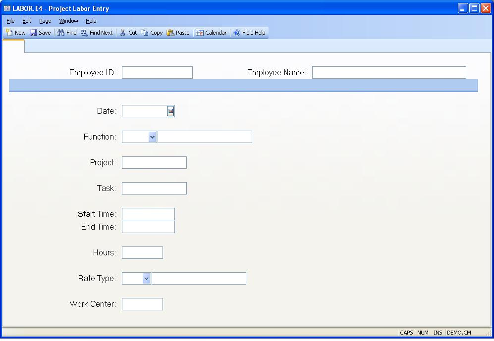

## Project Labor Entry (LABOR.E4)
<PageHeader />

##

| **Labor ID**|  The labor ID does not appear on the screen. A sequential
number is assigned by the system when the transaction is filed.

-  
**Employee ID**|  Enter the identification of the employee whose labor is to
be posted. The employee ID is checked against the entries in the employee
file.

**Employee Name**|  Contains the name of the employee identified by the
employee number entered. The name displayed is for information only and may
not be changed.

**Date**|  Enter the date on which the labor being posted was incurred. The
system will default the current date.

**Function**|  Enter the function to be used for the transaction. The function
defines the type of worked performed such as "Production" or "Rework" etc. For
project labor, the function code must be indirect (not associated with a work
order).

**Project Id**|  Enter the Project ID that incurred the labor cost to be
entered in the transaction.

**Task Id**|  Enter the task ID associated with the project for this labor
transaction. A lookup is provided to show all the tasks for the project.

**Start Time**|  If you want the system to calculate the hours to be charged
based on the time the employee started and ended work on the project, you may
enter the start time in this field and the end time in the next field. If you
wish to enter pre-calculated hours then you may leave the start and end times
blank. The times must be entered in 24 hour format (e.g. 1:00 P.M. is entered
as 13:00). It is assumed that the start and end occur within the same date.

**End Time**|  If you want the system to calculate the hours to be charged
based on the time the employee started and ended work on the project, you may
enter the end time in this field and the start time at the prior field. If you
wish to enter pre-calculated hours then you may leave the start and end times
blank. The times must be entered in 24 hour format (e.g. 1:00 P.M. is entered
as 13:00). It is assumed that the start and end occur within the same date.

**Hours**|  Enter the labor hours to be posted to the project. You may enter
up to 2 decimal places and both positive and negative numbers.

**Work Center**|  Enter the work center to be charged with the labor hours in
the transaction. It will initially be defaulted from the employee record.

**Function Description**|  Displays the description from the
[LABOR.CONTROL](../LABOR-CONTROL/README.md) record for the labor function entered.

**Rate Description**|  Displays the description from the
[LABOR.CONTROL](../LABOR-CONTROL/README.md) record for the rate type entered.

**Rate Type**|  Enter the labor type code to be used for the transaction. The
type code defines the factor to be applied to the pay rate for circumstances
such as overtime.

<badge text= "Version 8.10.57 " vertical="middle" />

<PageFooter />
