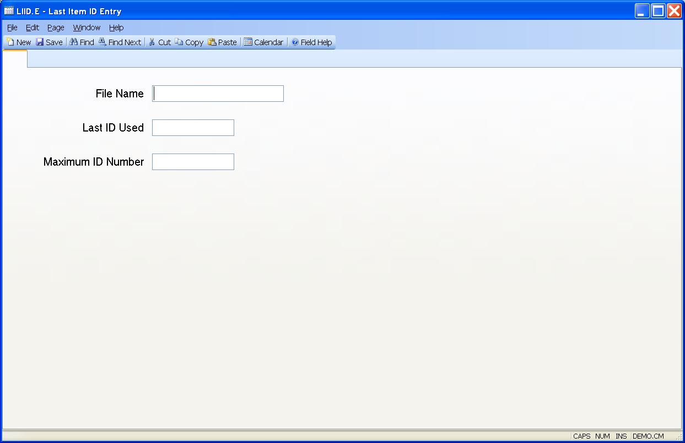

## Last Item ID Entry (LIID.E)
<PageHeader />

##

| **File Name**|  Enter the name of the file whose item ID data is to be setup
or changed.

-  
**Last ID Used**|  This field contains the last sequential ID assigned to a
record in the associated file. If you are setting up a new LIID record then
you may set this field to one number less than the number you want to use as
the first sequentially assigned ID in the file. For example, if you want the
first number to be 1 then set this field to 0; set it to 99 if you want the
first number to be 100 etc. You may also change the number on an existing LIID
record but you should not set the number to a lower number unless you are sure
that there are no existing records that may be overwritten when the system
begins assigning record IDs.

**Maximum ID Number**|  This field allows you to optionally set a maximum ID
number for the file. Procedures which are designed to use the information in
this field will automatically set the Last ID Number field back to 1 once this
number is reached. These procedures will also check to insure that they do not
overwrite existing records. This feature is useful for transaction files that
are purged on a regular basis and whose ID numbers have no long term
importance.

<badge text= "Version 8.10.57 " vertical="middle" />

<PageFooter />
