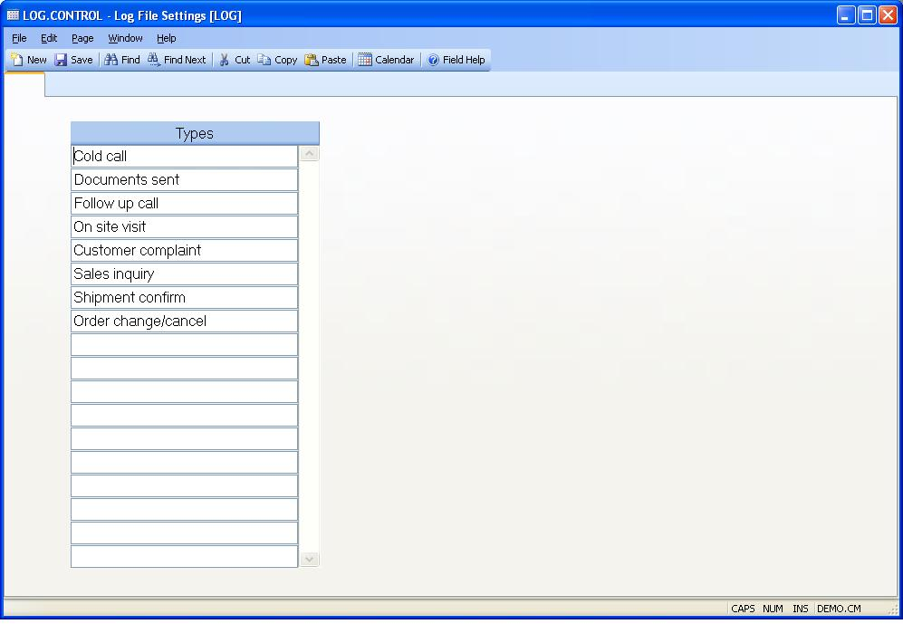

## Log File Settings (LOG.CONTROL)
<PageHeader />

##

| **Control ID**|  Automatically loaded with the text "LOG" when the process
is started. It is not visible and may not be changed.

-  
**Types**|  This field is used to define all of the log types that are
available to the user when making an entry in the [LOG.E](../LOG-E/README.md)
procedure.

<badge text= "Version 8.10.57 " vertical="middle" />

<PageFooter />
