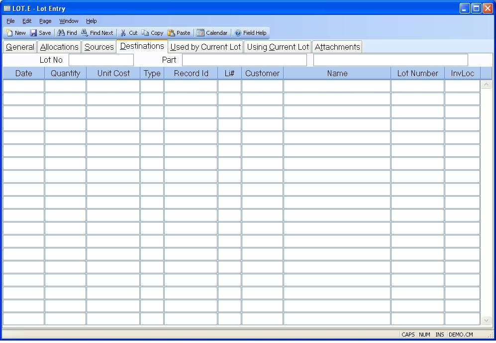

## Lot Entry (LOT.E)
<PageHeader />

## Destinations

| **Destination Date**|  Contains the date on which the associated transaction
used a quantity from the lot record.

-  
**Destination Qty**|  The quantity posted from the lot on the associated date.

**Destination Cost**|  Specifies the cost that was used when posting the items
in the associated transaction.

**Destination Type**|  This field contains a two digit code which defines the
type of document associated with the posting from the lot record. For example,
"WO" is work order etc.

**Destination ID**|  Contains the ID of the document associated with the
transaction which posted from the lot.

**Destination Li**|  The line item, if any, on the associated document that
initiated the posting from the lot record.

**Destination Customer**|  If the associated transaction was a shipment from a
sales order (Type = "SH") then this field will contain the number of the
customer on the purchase order.

**Destination Name**|  Contains the name of the customer on the sales order
for the items posted.

**Destination Lot**|  Contains the lot number to which the items on the
associated transaction were posted.

**Destination Loc**|  The location to which the items were moved in the
associated transaction.

**Lot#**|  The number of the current lot record being displayed.

**Part#**|  The number of the part which identifies the items on the current
lot.

**Desc**|  The first line of the part description as defined in the parts
master.

<badge text= "Version 8.10.57 " vertical="middle" />

<PageFooter />
