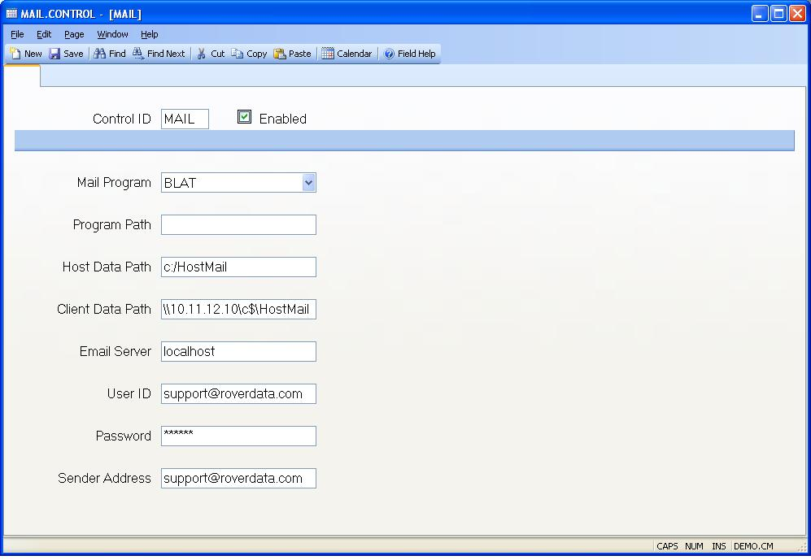

##  (MAIL.CONTROL)
<PageHeader />

##

| **Control ID**|  Automatically loaded with "MAIL" by the system when the
procedure is invoked.

-  
**Enabled**|  Check this box if sending email from the host is enabled.

**Mail Program**|  Select the host program to be used for sending email. The
options are BLAT (used on Windows), MUTT (used on Unix/Linux), or SENDMAIL
(used on Unix/Linux). Note: SENDMAIL does not support sending attachments. Use
MUTT if this is required.

**Program Path**|  Enter the path to the mail program.
For sendmail on Linux this is usually /usr/sbin.
On 32 bit Windows it is usually C:\PROGRA~1\ROVERD~1\M3Serv~1
On 64 bit Windows it is usually C:\PROGRA~2\ROVERD~1\M3Serv~

**Host Path**|  Enter the path to the directory that is to be used for
temporary files generated as part of the mail process. This path should be
specified from the perspective of the host (server) system.

**Client Path**|  Enter the path to the directory that is to be used for
temporary files generated as part of the mail process. This path should be
specified from the perspective of the client system and should point to the
same directory defined in the Host Path. It is used for situations where the
client computer needs to move attachment files to a place where the server can
access them and include them in the email. If there are no applications being
used that require this capability it does not need to be specified.

**Email Server**|  Enter the name (address) of the email server to be used
when email is generated.

**User Id**|  Enter the id of the user to be used with the mail server.

**Password**|  Enter the password for the user. If was entered previously a
string of six asterisks (*) will appear in this field. To change the password
replace these asterisks with the correct password for the user.

**Sender Address**|  Enter the default address to use as the sender when an
email message is sent. If you want the recipient to be able to reply to the
email this must be a valid email address, otherwise any text is sufficient.

<badge text= "Version 8.10.57 " vertical="middle" />

<PageFooter />
