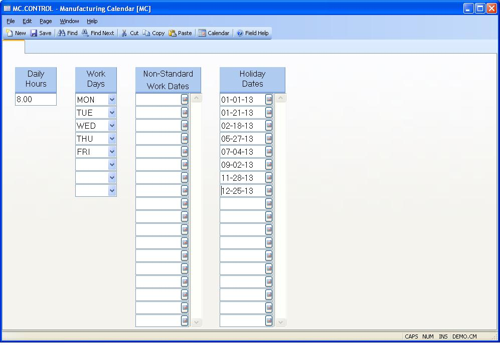

## Manufacturing Calendar (MC.CONTROL)
<PageHeader />

##

| **Control ID**|  The ID to this record is "MC" and is automatically assigned
by the system when the procedure is run.

-  
**Daily Hours**|  Enter the number of hours that work is performed on a normal
work day. These hours should specify the total of elapsed hours for all
shifts, not the available capacity in a day. This information is used as the
default for scheduling calculations when the daily hours have not been
specified for the work center.

**Work Days**|  Work days are defined by entering the three digit abbreviation
for each day of the week which is a normal work day. The valid entries are
MON, TUE, WED, THU, FRI, SAT, SUN. These are used by the system to determine
if a given date is a work day.

**Non-Standard Work Dates**|  This field defines all of the days for which
work has been planned, but are normally non-work days. You should enter the
date for each non-work day out to or beyond the planning horizon. Dates in the
past may be removed at any time since they no longer affect future planning.

**Holidays**|  This field is used to define all of the holidays on which
production will not take place. You should enter the date for each holiday out
to or beyond the planning horizon. Do not enter normal non-work days since
these are already defined by there absence in the work days definition. Dates
in the past may be removed at any time since they no longer affect future
planning.

<badge text= "Version 8.10.57 " vertical="middle" />

<PageFooter />
