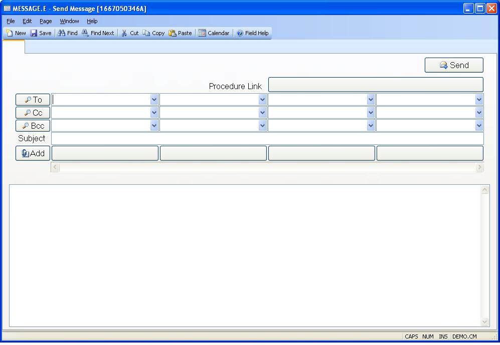

## Send Message (MESSAGE.E)
<PageHeader />

##

| **Message ID**|  Automatically loaded with the message id selected from the
MESSAGE.Q procedure.

-  
**To**|  Select the users that are to receive the message.

**Cc**|  Select the users to be copied on the message.

**Bcc**|  Select the users to be blind copied on the message. Users who
receive the message will not see the names of the users in the blind copy
section.

**Subject**|  Displays the subject of the message.

**Attachment**|  If there are attachments associated with the message they
will appear as butttons with the name of the attachment on the button. Click
the button to open the attachment.

**Procedure Link**|  If a link to a proces was included in the message then
text identifying the procedure will be displayed on the button. Clicking the
button will open the procedure using any scripted information that was
included in the message.

**Message**|  Enter the text to be included in the message.

**Send**|  Click this button to reply to the sender.

**To**|  Click this button to select all of the users that are to receive the
message.

**Cc**|  Click this button to select all of the users that are to receive
copies of the message.

**Bcc**|  Click this button to select all of the users that are to receive the
blind copies of the message. Other users receiving the message will not see
users included in the blind copy list.

**Add Attachment**|  Click this button to add an attachment to the message.

<badge text= "Version 8.10.57 " vertical="middle" />

<PageFooter />
