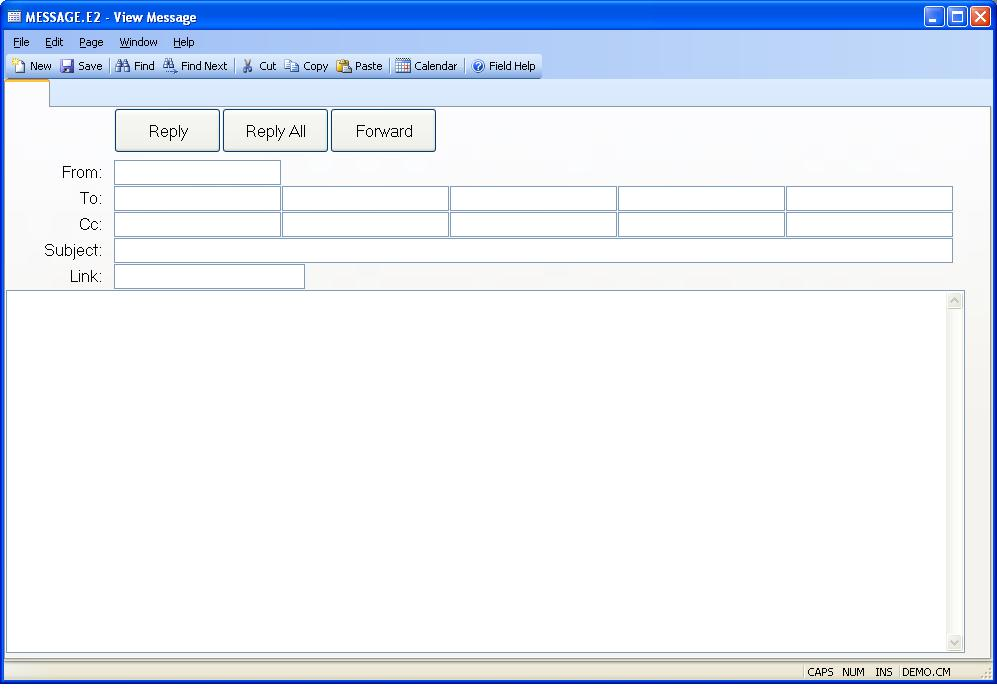

## View Message (MESSAGE.E2)
<PageHeader />

##

| **ID**|  The Id field is automatically skipped.

-  
**From**|  Displays the name of the user that sent the message.

**To User**|  Enter the user ids of each person that is to receive the
message.

**Cc User**|  Enter the Id of each user that is to receive the message as a
copy.

**Subject**|  Enter text describing the subject of the message.

**Link**|  If you are forwarding or replying to a previous message and the
original message contained a link to a procedure it will be displayed here.

**Message**|  Enter the text of the message to be sent.

**Reply**|  Click this button to reply to the sender of the message.

**Reply All**|  Click this button to reply to the sender and all recipients of
the message.

**Forward**|  Click this button to forward the message to another user.

<badge text= "Version 8.10.57 " vertical="middle" />

<PageFooter />
