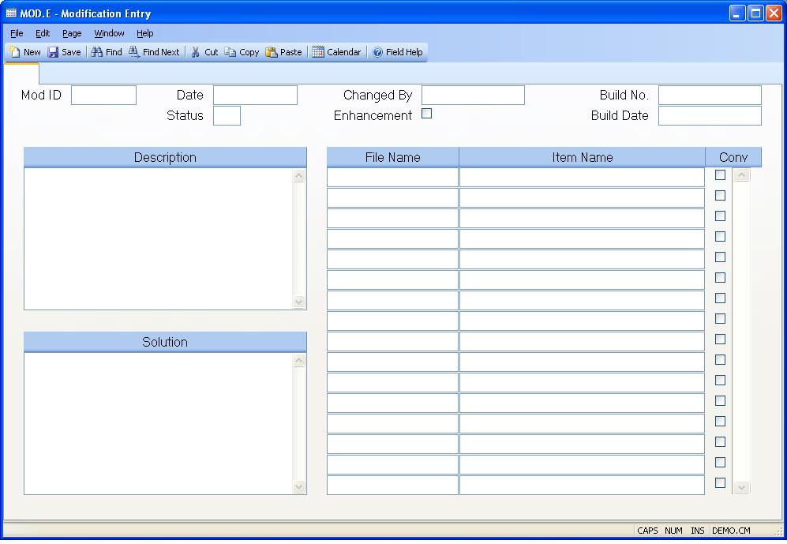

## Modification Entry (MOD.E)
<PageHeader />

##

| **Mod ID**|  The record ID assigned to this mod entry.

-  
**Date**|  The date this mod record was entered.

**Status**|  User defined

**Changed By**|  Enter the name of the person who made the changes documented
by the modification.

**Enhancement**|  Check this box if this modification represents an
enhancement to the product, rather than a bug fix.

**Build**|  This field contains the build number.

**Build Date**|  This field contains the build date.

**Description**|  Enter the description of the problem/modification.

**Solution**|  Enter a description of the solution/modification.

**File Name**|  The file name in which the assocaiated item was modified.

**Item Name**|  The name of the item in the file which was modified.

**Conversion**|  Check this box if the associated items is a conversion
program or procedure.

<badge text= "Version 8.10.57 " vertical="middle" />

<PageFooter />
