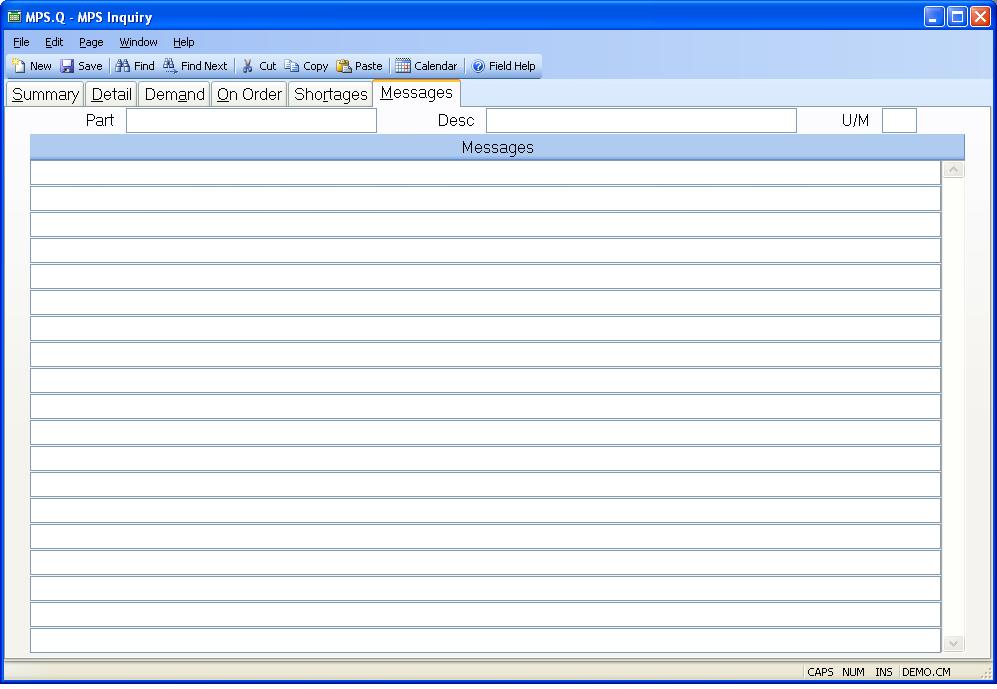

## MPS Inquiry (MPS.Q)
<PageHeader />

## Messages

| **Messages**|  Contains the exception messages generated during the MPS
processing.

-  
**Part#**|  Displays the part number currently being inquired.

**Desc**|  The part number description.

**UM**|  The inventory stocking unit of measure.

<badge text= "Version 8.10.57 " vertical="middle" />

<PageFooter />
