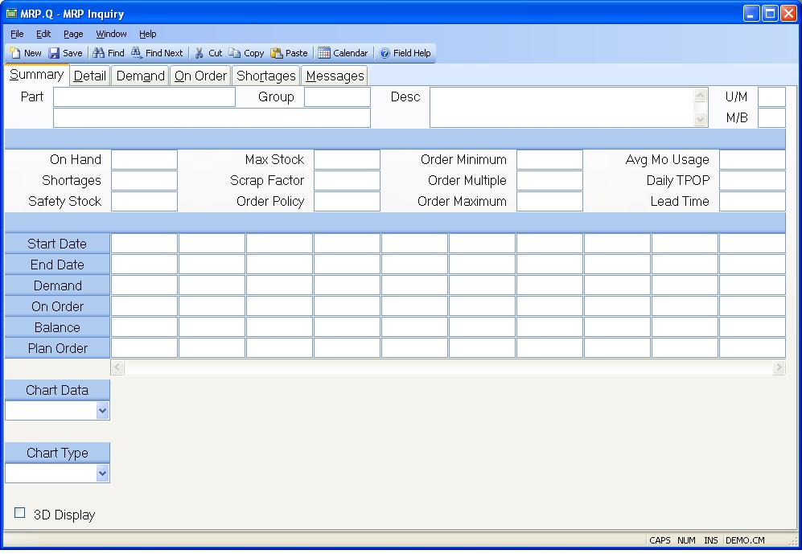

## MRP Inquiry (MRP.Q)
<PageHeader />

## Summary

| **Part Number**|  Enter the part number of the item you want to display on
the screen.

-  
**Group**|  Enter the planning group for which you wish to use this procedure.

**Part Status**|  Status of part number.

**Description**|  Contains the description of the part as entered in the parts
master.

**Unit of Measure**|  Contains the stocking unit of measure for the part
number entered.

**On Hand**|  Contains the inventory balance as it was at the time the MRP
calculations were performed for this part number. The actual on hand balance
may have changed since that time.

**Shortages**|  Contains the total number of the part which is short on work
orders at the time the MRP was generated. This quantity may not match the
total number of shortages shown on the shortage screen in this procedure since
the contents of that screen are taken from the current data.

**Safety Stock**|  Contains the minimum quantity of inventory which should be
maintained for the associated part. The initial on hand balance is reduced by
this amount in the MRP calculations.

**Max Stock**|  Contains the maximum projected inventory balance which is
allowed. Exceptions will be generated if this quantity is exceeded anywhere
within the planning horizon.

**Scrap Factor**|  Contains the scrap factor to be applied to the gross
requirements. The scrap factor is stated as the percentage of parts which are
expected to be scrapped as a part of normal operations. This is also known as
shrinkage. The system uses this factor to increase demand for the part by the
anticipated shrinkage. The demand generated by the scrap factor will appear as
an individual item in the pegging for the part.

**Order Policy**|  The order policy should be set to either "Fixed" or
"Discrete". If no order policy has been specified then discrete is assumed.
When the order policy is set to discrete the system plans only for the exact
quantity required. When set to fixed the system will apply the order modifiers
order minimum and order multiple to the planned order quantity.

**Order Minimum**|  Contains the recommended minimum order quantity for the
associated part number. Any order planned by the system will be greater than
or equal to the order minimum.

**Order Multiple**|  Contains the recommended order multiple which is used to
calculate planned order quantities. The planned order is rounded up to a
number which is evenly divisible by the order multiple.

**Order Maximum**|  Specifies the maximum quantity that should be ordered at
one time. This is used primarily as a trigger to cause an exception message to
be generated when a system planned order exceeds the maximum amount. The
planned order quantity is not reduced by the system.

**Average Monthly Usage**|  Contains the average monthly usage of the part
based on the available transaction history.

**Time Phased Order Point**|  The time phased order point when present will
drive demand for the part number such that gross requirements will always be
the greater of the time phased order point or actual demand for the period.
Time phased order points are generally set based on historical usage.

**Lead Time**|  The number of days normally required to procure the associated
part once an order has been placed. This number is used by the system to
determine when a planned order should be started.

**Period Start Date**|  This field contains the start date for each period and
the associated requirements, receipts, projected balance and planned order
quantity.

**Period End Date**|  This field contains the end date for each period and the
associated requirements, receipts, projected balance and planned order
quantity.

**Gross Requirments**|  Contains the sum of all the demand for the part number
which occur in the associated period.

**Scheduled Receipts**|  Contains the sum of all purchase order receipts and
all planned completions from work orders for the part number in the associated
time period.

**Projected Balance**|  Contains the current projected on-hand balance (less
safety stock and allocations) for the associated period.

**Planned Order**|  Contains the planned order quantity generated by the
system for the associated period. This quantity should be scheduled to for
availability by the associated period.

**Chart Data**|  Select the data that is to be displayed in the chart. The
options are:
Balance - The projected balance for each period.
Demand - The demand on the part for each period.
Cumm Demand - Demand for each period including demand from prior periods.
On Order - The replenishments currently scheduled for the part.
Cumm On Order - On Order for each period including on order from prior
periods.
Plan Orders - The system recommended planned order quantity for each period.
Cumm Plan Orders - Planned orders from each period including prior period
planned orders.

**Chart Type**|  Determines the format of the chart. Options are Bar, Area and
Line.

**3D Display**|  Check this box if the chart is to be displayed with a three
dimensional look.

**Chart**|  Displays a chart showing either the demand, on order or projected
balance.

**Make/Buy**|  Contains the make/buy code for the part number and plan group
entered.

<badge text= "Version 8.10.57 " vertical="middle" />

<PageFooter />
