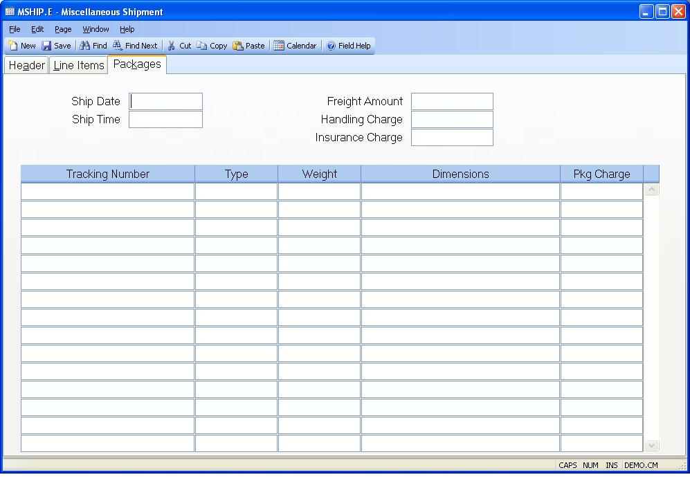

## Miscellaneous Shipment (MSHIP.E)
<PageHeader />

## Packages

| **Ship Date**|  The ship date as recorded by the freight carrier.

-  
**Ship Time**|  The time of shipment as recorded by the freight carrier.

**Total Freight**|  The freight charge as recorded by the freight carrier for
this shipment.

**Handling Charge**|  The handling charge as recorded by the freight carrier
for this shipment.

**Ins Charge**|  The insurance charge as recorded by the freight carrier for
this shipment.

**Pkg Tracking**|  The package tracking number, as assigned by the freight
carrier.

**Pkg Type**|  The package type, as assigned by the freight carrier.

**Pkg Weight**|  The weight of the package, as determined by the freight
carrier.

**Pkg Dim**|  The dimensions of the package.

**Pkg Charge**|  The freight charge for this package/tracking number.

<badge text= "Version 8.10.57 " vertical="middle" />

<PageFooter />
