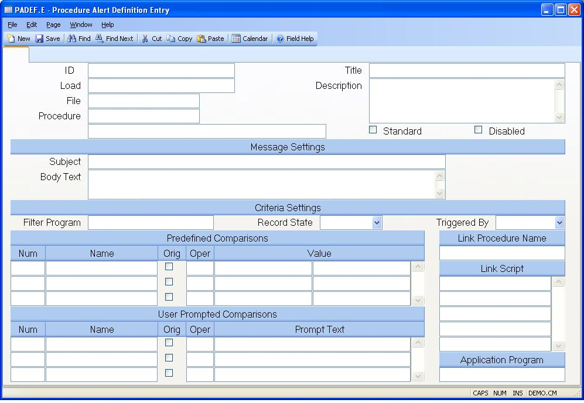

## Procedure Alert Definition Entry (PADEF.E)
<PageHeader />

##

| **ID**|  Enter the name of an existing or new procedure alert definition.

-  
**Load**|  Enter the name of an existing definition to load as the basis for
the definition currently being defined.

**File Name**|  Enter the name of the file whose changes are to be checked for
this alert. Leave this field blank if you want to have the alert based on the
actions of a procedure instead.

**Procedure**|  Enter the name of the procedure that triggers the action
defined for the alert. Leave this field blank if you want changes to a record
in a file to trigger the alert.

**Procedure Description**|  Displays the title of the associated procedure.

**Title**|  Enter the title to be displayed when this definition is shown in a
list of available procedure alert definitions.

**Description**|  Enter a complete description of what the procedure alert is
defined to do.

**Standard**|  Check this box if the definition is part of the standard
product.

**Disabled**|  Check this box if the definition is to be disabled so that it
is not available for use.

**Message Subject**|  Enter the text that is to appear in the subject area of
the message generated by the alert. You may embed information from the data
records (A$RECORD and A$PROMPT) within the text be entering
&#nn,value,subvalue for data in A$RECORD where nn is the field number, and
&#Tnn,value,subvalue for data in A$PROMPT, and &#Onn,value,subvalue for data
in the original A$RECORD. If the text following the data information is
anything other than a space you must append another & to the end of the data
information. For example, &#12,1,2&. You also extract the values entered by
the user from the user prompt section by specifying &#Pn were n is the number
representing which prompt in the sequence you want to use. You may also
specify an indirect reference to data in another file. For example, suppose
you were creating an alert based on the AP file and wanted to extract the
vendor's name. Since the AP file does not contain the vendor's name you must
translate it from the VENDOR file using the following syntax
&#<VENDOR,1 ,&#1> where VENDOR is the name of the file, 1 is the field in
the vendor record to be extracted and &#1 is the data in field number 1 of the
AP record (vendor id). </TD> </TR> <TR> <TD valign="top"
width="155"><b>BodyText</b></TD><TD width="490">Enter the text that is to
appear in the body of the message generated by the alert. You may embed
information from the data records (A$RECORD and A$PROMPT) within the text by
entering &#nn for data in A$RECORD where nn is the field number, and &#Tnn for
data in A$PROMPT. If the text following the data information is anything other
than a space you must append another & to the end of the data information. For
example, &#12,1,2&. You also extract the values entered by the user from the
user prompt section by specifying &#Pn were n is the number representing which
prompt in the sequence you want to use. You may also specify an indirect
reference to data in another file. For example, suppose you were creating an
alert based on the AP file and wanted to extract the vendor's name. Since the
AP file does not contain the vendor's name you must translate it from the
VENDOR file using the following syntax &#<VENDOR,1,&#1> where VENDOR is the
name of the file, 1 is the field in the vendor record to be extracted  and
&#1 is the data in field number 1 of the AP record (vendor id). </TD> </TR>
<TR> <TD valign="top" width="155"><b>Criteria Program Name</b></TD><TD
width="490">If the parameters by which the alert is triggered are determined
by a called subroutine enter the subroutine name in this field. This
subroutine must have six arguments. The first argument contains the id to the
record that triggered the alert, the second contains the PALERT record as an
array dimensioned to 50 and can be changed by the program to affect the output
of the message, the third contains the data record after processing as an
array dimensioned to 200, the fourth contains the temporary data after
processing as an array dimensioned to 200, the fifth contains the data record
before processing as an array dimensioned to 200, and the last argument should
return 1 (true) if the alert is to be sent or zero (false) if not. </TD>
</TR> <TR> <TD valign="top" width="155"><b>Record State</b></TD><TD
width="490">Select the record state that must be in effect for the alert to be
triggered: New, Existing or Any. </TD> </TR> <TR> <TD valign="top"
width="155"><b>Triggered By</b></TD><TD width="490">Select the action taken
against the procedure that will trigger the alert: Save, Delete, Any. </TD>
</TR> <TR> <TD valign="top" width="155"><b>Field Number</b></TD><TD
width="490">Enter the number of the field against which the comparison is to
be made. For temporary fields precede the number with the letter "T". For a
list of avialable fields use the lookup option in the right click menu for
this field. </TD> </TR> <TR> <TD valign="top" width="155"><b>Field
Name</b></TD><TD width="490">Displays the name of the associated
field. </TD> </TR> <TR> <TD valign="top" width="155"><b>Data Orig
Rec</b></TD><TD width="490">Check this box if the data to be used for the
comparison should come from the associated field before it was updated by the
procedure. This only applies to the actual data record, not the temporary
fields. </TD> </TR> <TR> <TD valign="top" width="155"><b>Field
Oper</b></TD><TD width="490">Enter the comparison operator to be used against
the associated field. Note: If you are performing a comparison using the &#
construct to define the values the the right of this operator only the EQ
(equal) and NEQ (not equal) are valid entries. All others will be
ignored. </TD> </TR> <TR> <TD valign="top" width="155"><b>Field
Value</b></TD><TD width="490">Enter the value to used in the comparison with
the associated field. You may enter a literal value or reference data from
either the new or original record. To indicate a reference to a field in the
new record end &#n where n is the number of the field. To compare data from
the original record enter &#On. For data in a temporary field enter &#Tn. For
example, &#12,1,2&. You may also specify an indirect reference to data in
another file. For example, suppose you were creating an alert based on the AP
file and wanted to extract the vendor's name. Since the AP file does not
contain the vendor's name you must translate it from the VENDOR file using the
following syntax &#<VENDOR,1,&#1> where VENDOR is the name of the file, 1 is
the field in the vendor record to be extracted and &#1 is the data in field
number 1 of the AP record (vendor id).  If you want to specify that the
comparison is against a null value, and only a null value, you can leave the
field blank. If you want to specify that the comparison is against some a null
value and some other value enter the text <nil> to signify the null
value. </TD> </TR> <TR> <TD valign="top" width="155"><b>Prompt
Num</b></TD><TD width="490">Enter the number of the field against which the
comparison is to be made. For temporary fields precede the number with the
letter "T". For a list of avialable fields use the lookup option in the right
click menu for this field. </TD> </TR> <TR> <TD valign="top"
width="155"><b>Field Name</b></TD><TD width="490">Displays the name of the
associated field. </TD> </TR> <TR> <TD valign="top" width="155"><b>Prompt
Orig Rec</b></TD><TD width="490">Check this box if the data to be used for the
comparison should come from the associated field before it was updated by the
procedure. This only applies to the actual data record, not the temporary
fields. </TD> </TR> <TR> <TD valign="top" width="155"><b>Prompt
Oper</b></TD><TD width="490">Enter the comparison operator to be used against
the associated field. </TD> </TR> <TR> <TD valign="top"
width="155"><b>Prompt Text</b></TD><TD width="490">Enter the text that is to
appear to the user when being prompted for the information to be used in the
comparison. </TD> </TR> <TR> <TD valign="top" width="155"><b>Link Procedure
Name</b></TD><TD width="490">If you want to a link to another procedure to be
presented to the user receiving the alert message enter the name of the
procedure in this field. </TD> </TR> <TR> <TD valign="top"
width="155"><b>Link Script</b></TD><TD width="490">Enter the script to be used
against the link procedure. You may embed information from the data records
(A$RECORD and A$PROMPT) by entering &#nn for data in A$RECORD where nn is the
field number, and &#Tnn for data in A$PROMPT. For example, &#12,1,2&. You also
extract the values entered by the user from the user prompt section by
specifying &#Pn were n is the number representing which prompt in the sequence
you want to use. You may also specify an indirect reference to data in another
file. For example, suppose you were creating an alert based on the AP file and
wanted to extract the vendor's name. Since the AP file does not contain the
vendor's name you must translate it from the VENDOR file using the following
syntax &#<VENDOR,1,&#1> where VENDOR is the name of the file, 1 is the field
in the vendor record to be extracted and &#1 is the data in field number 1 of
the AP record (vendor id). </TD> </TR> <TR> <TD valign="top"
width="155"><b>Application Program</b></TD><TD width="490">You can setup an
alert so that it calls an application program specified in this field when the
alert is triggered. This subroutine must have five arguments. The first
argument contains the id to the record that triggered the alert, the second
contains the PALERT record as an array dimensioned to 50, the third contains
the data record after processing as an array dimensioned to 400, the fourth
contains the temporary data after processing as an array dimensioned to 400,
and the fifth contains the data record before processing as an array
dimensioned to 400. Note: changes to any of these data elements will be
ignored so if manipluation of the data record is require it must be read and
written within the program. </TD> </TR> </TABLE> 
<a
href="PADEF-E/README.md">Previous</A> </TD> </TABLE> </TD> </TR> </TABLE> </TR>
</TABLE> 
&copy; Copyright 2015, Rover Data Systems,
Inc. All rights reserved. Version 8.10.57 
 </BODY> </HTML>

<badge text= "" vertical="middle" /><PageFooter />
