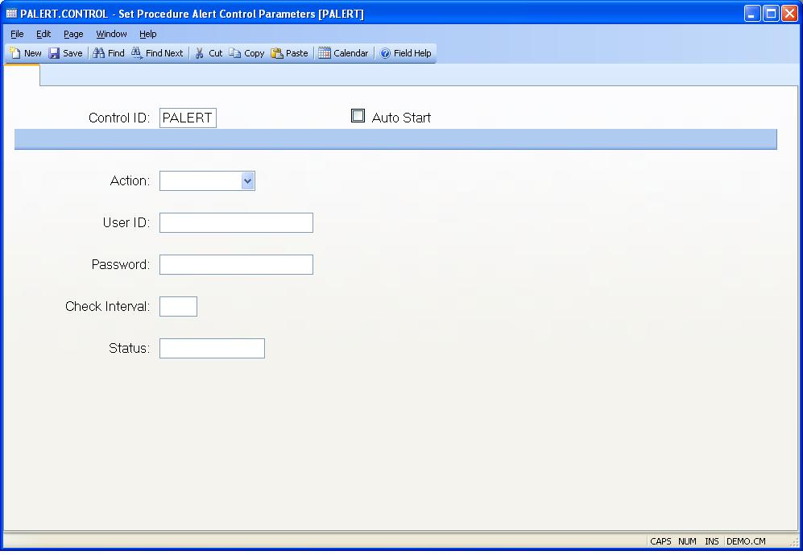

## Set Procedure Alert Control Parameters (PALERT.CONTROL)
<PageHeader />

##

| **Control ID**|  Automatically loaded with "ALERT" by the system when the
procedure is invoked.

-  
**Auto Start**|  Check this box if the process that handles procedure alert
messages is to be started automatically when the system is started.

**Action:**|  Enter "Start" to launch the message queue process, "Stop" to end
the currently running process, or "Reset" to reset the procedure in cases of
an abnormal shutdown of the system or process.

**User Id**|  Enter the user id to be used for logging on the procedure alert
process. This user must be defined in the SECURITY.E procedure with login
rights to the local data account.

**Password**|  Enter the password for the user. If a password was previously
entered then a string of six asterisks (*) will appear in this field. To
change the password replace the asterisks with the correct password for the
user.

**Check Interval**|  Enter the interval in seconds at which the background
process should check for procedure alerts that require processing. If nothing
is entered 60 seconds is assumed.

**Status**|  Displays the status of the process.

<badge text= "Version 8.10.57 " vertical="middle" />

<PageFooter />
